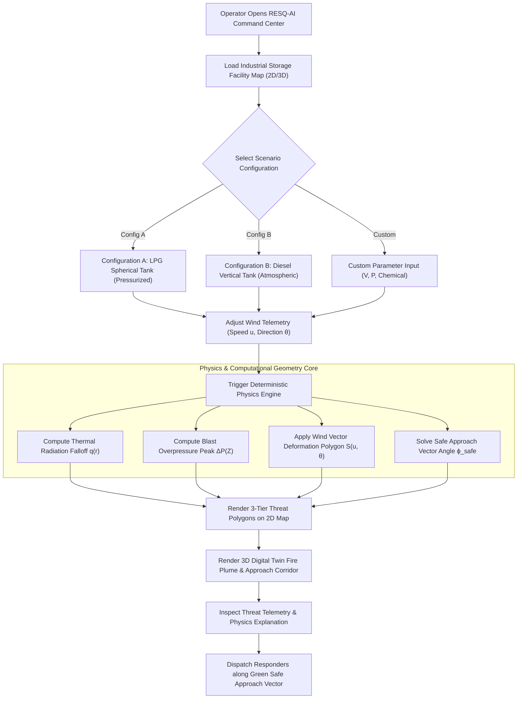

# 04 — User Workflow Specification
## DER-02: Operational Workflow & Scenario Execution

---

## 1. Primary Operator Workflow Diagram

---

## 2. Detailed Operational Use Cases

### Use Case 1: Initial Threat Zone Assessment
1. Operator launches RESQ-AI Threat Command Center.
2. System displays default industrial site (e.g. Chennai Petrochemical Industrial Zone).
3. Physics engine automatically computes and overlays:
   - **Red Zone (Lethal)**
   - **Orange Zone (Severe Threat)**
   - **Yellow Zone (Caution / Evacuation Perimeter)**
   - **Green Vector**: Recommends safe responder staging area (e.g., $315^\circ$ NW crosswind approach).

### Use Case 2: Live Wind Speed & Shift Telemetry Update
1. Operator modifies wind speed from $5\text{ m/s}$ to $18\text{ m/s}$ and rotates wind direction to $135^\circ$ SE.
2. System instantly updates the threat contours:
   - Polygons visibly stretch downwind towards the Southeast.
   - Upwind boundary compresses closer to the storage tank.
   - The Green Safe Approach Vector dynamically recalculates to point into the new upwind/crosswind safe zone.

### Use Case 3: Dual Facility Comparison (LPG Sphere vs Diesel Tank)
1. Operator clicks **`[ Compare Configuration A vs B ]`**.
2. System splits view or toggles between:
   - **Configuration A (Pressurized LPG)**: Shows a high blast shockwave radius ($50\text{ kPa}$ reaches $185\text{ m}$) due to high vapor pressure and BLEVE risk.
   - **Configuration B (Atmospheric Diesel)**: Shows a large thermal radiation footprint ($5\text{ kW/m}^2$ reaches $520\text{ m}$) due to high pool fire surface area, with minimal blast overpressure ($25\text{ m}$).
3. Telemetry card explains the thermodynamic physics rationale behind the differences.
