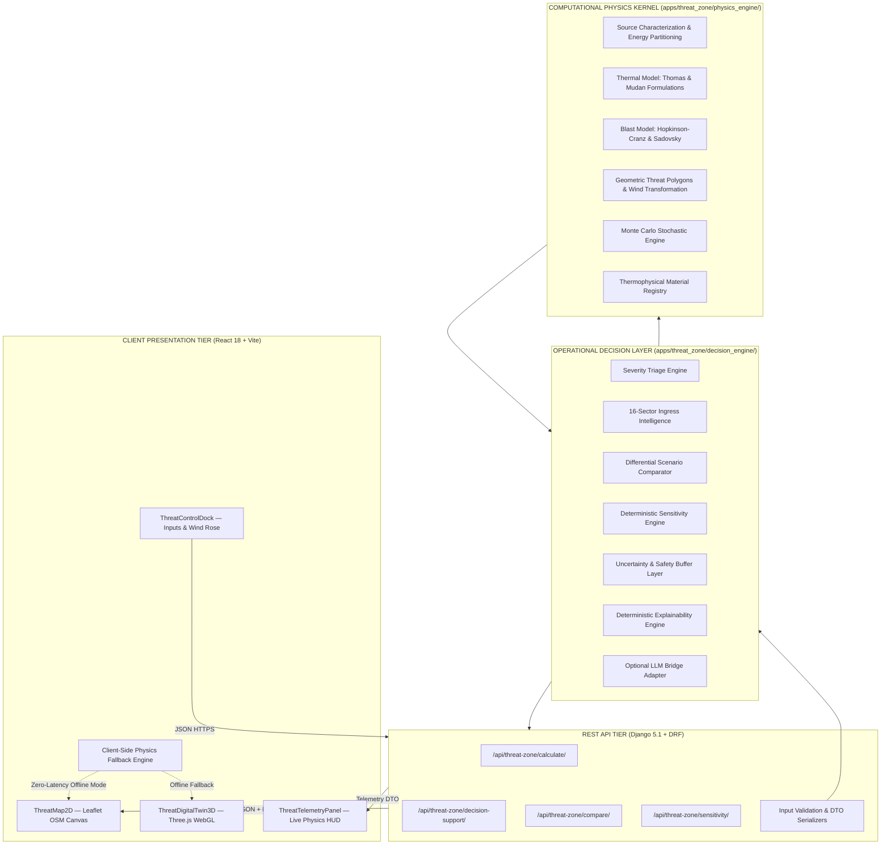
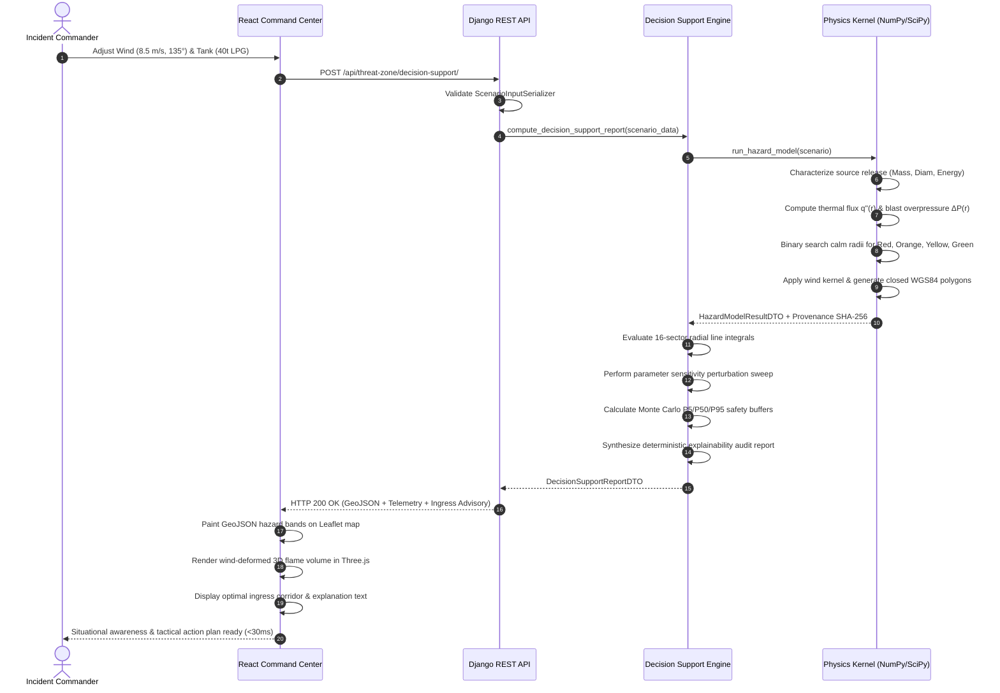
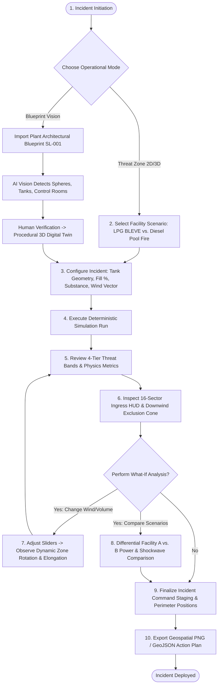
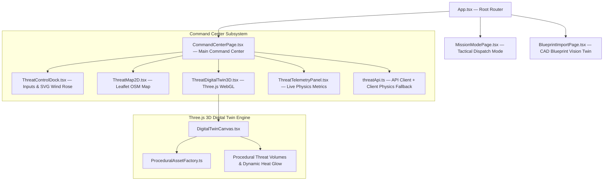
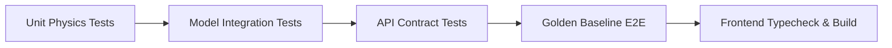

# RESQ AI

> Industrial Fire & Explosion Threat-Zone Estimation and Emergency Response Decision Support System

[]()
[]()
[]()
[]()
[]()
[]()
[]()
[]()

---

## Table of Contents

- [1. Overview](#1-overview)
- [2. Problem Statement](#2-problem-statement)
- [3. Solution Overview](#3-solution-overview)
- [4. Key Features](#4-key-features)
- [5. What Makes RESQ AI Different](#5-what-makes-resq-ai-different)
- [6. System Architecture](#6-system-architecture)
- [7. Complete Data Flow](#7-complete-data-flow)
- [8. User Workflow](#8-user-workflow)
- [9. Computational Engine](#9-computational-engine)
- [10. Mathematical Foundation](#10-mathematical-foundation)
  - [10.1 Thermal Radiation Model](#101-thermal-radiation-model)
  - [10.2 Blast Overpressure Model](#102-blast-overpressure-model)
  - [10.3 Roberts BLEVE Fireball Correlations](#103-roberts-bleve-fireball-correlations)
  - [10.4 Wind-Dependent Hazard Geometry](#104-wind-dependent-hazard-geometry)
- [11. Hazard Severity Classification](#11-hazard-severity-classification)
- [12. Directional Exposure & Approach Intelligence](#12-directional-exposure--approach-intelligence)
- [13. Scenario Comparison Engine](#13-scenario-comparison-engine)
- [14. Deterministic Sensitivity Analysis](#14-deterministic-sensitivity-analysis)
- [15. Probabilistic Uncertainty Analysis](#15-probabilistic-uncertainty-analysis)
- [16. Transparent Explainability Audit Trail](#16-transparent-explainability-audit-trail)
- [17. Why No Dataset Is Required](#17-why-no-dataset-is-required)
- [18. Frontend Architecture](#18-frontend-architecture)
- [19. Backend Architecture](#19-backend-architecture)
- [20. API Documentation](#20-api-documentation)
- [21. External Services & APIs](#21-external-services--apis)
- [22. Environment Variables](#22-environment-variables)
- [23. Technology Stack](#23-technology-stack)
- [24. Repository Structure](#24-repository-structure)
- [25. Installation & Setup](#25-installation--setup)
- [26. Quick Start Guide](#26-quick-start-guide)
- [27. Demo Walkthrough](#27-demo-walkthrough)
- [28. Two-Scenario Demonstration](#28-two-scenario-demonstration)
- [29. Validation & Testing](#29-validation--testing)
- [30. Performance & Scalability](#30-performance--scalability)
- [31. Security & Safety Integrity](#31-security--safety-integrity)
- [32. Safety & Scientific Limitations](#32-safety--scientific-limitations)
- [33. Project Roadmap](#33-roadmap)
- [34. Contributing](#34-contributing)
- [35. License & Team](#35-license--team)

---

## 1. Overview

**RESQ AI** is an industrial fire and explosion threat-zone estimation and emergency-response decision-support system. Engineered for high-stakes industrial complexes, petrochemical refineries, bulk fuel terminals, and municipal fire brigades, the platform computes physical consequence envelopes and translates continuous numerical fields into tactical responder decisions.

The system integrates:
- **Deterministic Computational Hazard Modeling**: Direct implementation of peer-reviewed combustion and gas-dynamics formulations.
- **Thermal Radiation Analysis**: Solid-flame cylindrical cylinder models (pool fires) and spherical fireball radiation (BLEVE).
- **Blast Overpressure Analysis**: Hopkinson–Cranz cube-root scaling coupled with Sadovsky and Kingery–Bulmash shock equations.
- **Wind-Dependent Anisotropic Geometry**: Downwind plume elongation, flame tilt, and upwind compression.
- **Graded Severity Bands**: 4 discrete consequence tiers mapped to internationally vetted life-safety thresholds (CCPS, API 521, FEMA 426).
- **Geographic & 3D Visualization**: Dual-mode rendering with live OpenStreetMap raster overlays (2D Leaflet) and an interactive Three.js industrial digital twin (3D WebGL).
- **16-Sector Approach Intelligence**: Line-integral exposure evaluation identifying optimal upwind corridors and downwind exclusion cones.
- **Differential Scenario Comparison**: Physics-grounded contrast between disparate facilities (e.g., pressurized gas BLEVE vs. liquid pool fire).
- **Deterministic Sensitivity & Uncertainty**: Elasticity parameter sweeps and Monte Carlo safety buffer margins ($P_5, P_{50}, P_{95}$).
- **Transparent Explainability**: Template-driven, zero-hallucination natural language audit trails answering *why* zones form and *which* hazard governs.

---

## 2. Problem Statement

In industrial fire and explosion incidents—such as boiling liquid expanding vapor explosions (BLEVE), pressurized tank ruptures, and bunded hydrocarbon pool fires—incident commanders face extreme cognitive load under severe time constraints.

Traditionally, emergency responders have relied on **fixed-radius circular evacuation buffers** or static Emergency Response Guidebook (ERG) lookup tables. In real industrial environments, this heuristic introduces life-critical failures:
1. **Thermal Radiation Decay**: Radiant flux attenuates with distance according to solid-angle view factors and atmospheric transmissivity ($\tau_a$), not a uniform circle.
2. **Blast Shockwave Scaling**: Overpressure decays along a cube-root scaled distance ($Z = R / W^{1/3}$), decaying rapidly in the near field while shattering glass kilometers away.
3. **Wind Anisotropy**: Ambient wind shears the thermal flame column, tilting radiative energy downwind and compressing upwind hazard boundaries. Responders staging upwind can operate significantly closer than those downwind.
4. **Disparate Physical Mechanisms**: Overpressure and thermal radiation have completely different injury kinematics. Direct mathematical mixing (e.g., comparing $\text{kW/m}^2$ against $\text{kPa}$) is physically meaningless without an ordinal triage framework.

```
TRADITIONAL HEURISTIC (DANGEROUS):
      [ Fixed Circle R = 500m ]  --> Ignores wind tilt, blast kinematics, and actual terrain.

PHYSICS-INFORMED HAZARD MODEL (RESQ AI):
      <=== Wind Vector (8.5 m/s @ 135°) ===
      [Compressed Upwind Corridor] <--- [Ignition Origin] ---> [Elongated Downwind Plume Zone]
      (Zone 1: Lethal | Zone 2: Serious | Zone 3: Injury | Zone 4: Awareness)
```

RESQ AI replaces arbitrary circles with rigorously modeled, directionally asymmetric threat zones overlaid on real geographic coordinates.

---

## 3. Solution Overview

RESQ AI delivers an end-to-end operational pipeline that takes raw facility inventory, vessel geometry, and ambient wind conditions, computes physical consequence distributions, and synthesizes operational command advisories.

```mermaid
flowchart TD
    subgraph Inputs["1. Incident Parameters"]
        A1[Facility & Tank Geometry]
        A2[Stored Substance & Inventory]
        A3[Wind Vector & Ambient Weather]
        A4[Release & Ignition Scenario]
    end

    subgraph CoreEngine["2. Computational Physics Kernel"]
        B1[Source Characterization & Energy Partitioning]
        B2[Thermal Model: Thomas Flame Length & Mudan Tilt]
        B3[Blast Model: TNT Equivalence & Sadovsky Shock]
        B4[Wind Kernel & Asymmetric Coordinate Deformation]
        B5[Root-Finding & Multi-Band Polygon Solver]
    end

    subgraph DecisionLayer["3. Operational Decision Support Layer"]
        C1[Multi-Factor Severity Triage]
        C2[16-Sector Ingress Exposure Solver]
        C3[Differential Scenario Comparator]
        C4[Deterministic Parameter Sensitivity Sweep]
        C5[Monte Carlo Uncertainty & Safety Buffers]
        C6[Zero-Hallucination Explainability Audit Trail]
    end

    subgraph Visualization["4. Operator Presentation Tier"]
        D1[Leaflet 2D OpenStreetMap Threat Zones]
        D2[Three.js 3D Industrial Digital Twin]
        D3[Tactical Approach Vector & Telemetry HUD]
        D4[Natural Language Command Briefing]
    end

    Inputs --> CoreEngine
    CoreEngine --> DecisionLayer
    DecisionLayer --> Visualization
```



---

## 4. Key Features

| Feature | Description | Engineering Basis | Operator View |
| :--- | :--- | :--- | :--- |
| **Facility Configuration** | Parametric tank sizing, orientation, fill level, and substance selection. | Volume-mass thermodynamic coupling ($M = V \cdot \phi \cdot \rho_{liq}$). | Sliders for diameter, volume, fill %, and fuel dropdowns. |
| **Thermal Modeling** | Radiative heat flux calculation for pool fires and BLEVE fireballs. | Thomas (1963) flame length, Mudan (1984) tilt, Wayne (1991) transmissivity. | Radiative power (MW), flame height (m), and downwind tilt (°). |
| **Blast Modeling** | Shockwave overpressure from vapor cloud explosion or vessel burst. | Hopkinson–Cranz scaling ($Z$), Sadovsky (1952) & Kingery–Bulmash polynomials. | Peak overpressure ($\text{kPa}$ / $\text{psi}$), TNT equivalent mass (kg). |
| **Wind-Warped Geometry** | Elliptical elongation along the wind vector; upwind compression. | Gaussian plume coupling constant ($k=0.06$) and flame centroid shift. | Directionally asymmetric contours dynamically oriented to wind. |
| **4 Graded Severity Bands** | Four nested impact perimeters for life safety, triage, and staging. | API 521, CCPS 2010, FEMA 426 criteria (Red, Orange, Yellow, Green). | Color-coded map polygons with nominal distance labels. |
| **Interactive 2D Map** | Real-world map visualization with dynamic vector layers. | Leaflet.js with standard OpenStreetMap raster tiles (zero API key). | Draggable facility pin, wind arrow, and approach corridor. |
| **3D Industrial Digital Twin** | Procedural WebGL rendering of tanks, pipe racks, and threat volumes. | Three.js procedural geometry with atmospheric lighting and orbit controls. | Interactive 3D scene with perspective toggle and asset inspection. |
| **16-Sector Approach Intelligence** | Tactical ingress risk evaluation across 16 compass bearings ($22.5^\circ$). | Radial line-integral exposure calculation ($\int [q''/q_{ref} + \Delta P/\Delta P_{ref}] dr$). | Recommended entry bearing card, crosswind zones, exclusion cone. |
| **Scenario Comparison** | Instant differential contrast between two facility configurations. | Kinematic power release rates, blast delta, and perimeter offset. | Side-by-side metrics table with comparative physical explanation. |
| **Sensitivity Analysis** | Parameter gradient evaluation isolating primary hazard drivers. | Deterministic finite-difference perturbation ($\partial R / \partial x$). | Parameter elasticity rankings (Primary, Secondary, Negligible). |
| **Uncertainty Modeling** | Operational safety buffers derived from input variability. | Monte Carlo percentile distribution ($P_5, P_{50}, P_{95}$) and buffer margins. | Conservative standoff distance (m) and confidence rating. |
| **Explainability Engine** | Transparent rationale answering the 6 core operational questions. | Rule-based, template-driven synthesis directly from computed DTO facts. | Human-readable audit narrative answering *why* zones exist. |

---

## 5. What Makes RESQ AI Different?

| Differentiating Area | Traditional Industry Approach | The RESQ AI Approach | Operational Benefit |
| :--- | :--- | :--- | :--- |
| **Hazard Geometry** | Fixed-radius circular buffer (e.g. 500m circle from ERG). | Wind-dependent analytical ellipse factoring flame tilt and advection. | Prevents sending responders downwind; permits closer safe upwind staging. |
| **Consequence Physics** | Generic lookup tables without vessel-specific parameters. | Coupled thermal solid-flame view factors + blast shockwave scaling. | Scientifically defensible boundaries tailored to actual stored mass and geometry. |
| **Multi-Hazard Fusion** | Ad-hoc guesswork or arbitrary mixing of different units. | Ordinal rank triage preserving physical unit boundaries ($q''$ vs. $\Delta P^\circ$). | Unambiguous hazard dominance identification (thermal vs. blast). |
| **Responder Ingress** | Static manual compass assessment by commander. | Automated 16-sector line-integral exposure evaluation. | Pinpoints optimal ingress corridors and flags hazardous downwind cones. |
| **Scenario Contrast** | Recalculating separate spreadsheets without context. | Automated differential comparator highlighting power release rates. | Clarifies why an LPG BLEVE demands immediate evacuation while a diesel fire allows cooling. |
| **Explainability** | Black-box calculations or unconstrained LLM hallucinations. | Fully traceable deterministic templates with SHA-256 input provenance. | Complete audit trail for incident commanders, safety officers, and legal inquiries. |

---

## 6. System Architecture

RESQ AI employs a decoupled, layered architecture where the computational physics kernel is completely isolated from database, UI, and network frameworks.



---

## 7. Complete Data Flow



---

## 8. User Workflow



---

## 9. Computational Engine

The computational engine (`backend/apps/threat_zone/physics_engine/`) is a zero-dependency scientific library built using Python standard library and NumPy/SciPy. It executes strictly deterministic calculations without reliance on web frameworks, databases, or external network connections.

### Mathematical Foundations Summary

1. **Source Characterization**:
   - Liquid mass in tank: $M = V_{tank} \cdot \phi_{fill} \cdot \rho_{liquid}$
   - Total stored chemical energy: $E_{chem} = M \cdot \Delta H_c$
   - Liquid pool diameter (unconfined): $D_{pool} = 2 \sqrt{\frac{V_{spill}}{\pi \cdot h_{min}}}$
   - Liquid pool diameter (bunded): $D_{pool} = D_{bund}$

2. **Thermal Radiation Modeling**:
   - Thomas (1963) dimensionless flame length
   - Mudan (1984) aerodynamic flame tilt
   - Moorhouse (1982) & Wayne (1991) atmospheric transmissivity
   - Solid-flame geometric view factors for vertical cylinders and spheres

3. **Blast Overpressure Modeling**:
   - Hopkinson–Cranz cube-root scaling law
   - Sadovsky (1952) peak side-on overpressure equation
   - Kinney & Graham / Kingery–Bulmash 10-term polynomial verification

4. **Atmospheric & Wind Deformation**:
   - Meteorological azimuth to downwind transport vector transformation
   - Gaussian plume anisotropic boundary deformation ($k = 0.06$)

---

## 10. Mathematical Foundation

### 10.1 Thermal Radiation Model

#### Equation 1: Thomas (1963) Dimensionless Flame Length (`EQ-THERM-01`)
Predicts the turbulent buoyant flame height of an industrial pool fire under crosswind conditions:

$$u^* = \frac{u_w}{\left(\frac{g \cdot \dot{m}'' \cdot D}{\rho_v}\right)^{1/3}}$$

$$L_{flame} = 55 \cdot D \cdot \left(\frac{\dot{m}''}{\rho_a \sqrt{g \cdot D}}\right)^{0.67} \cdot (u^*_{\text{clamped}})^{-0.21}$$

| Variable | Definition | Units | Physical Context |
| :--- | :--- | :--- | :--- |
| $L_{flame}$ | Visible flame length | $\text{m}$ | Height of burning flame column above pool surface |
| $D$ | Pool diameter | $\text{m}$ | Equivalent circular diameter of burning fuel surface |
| $\dot{m}''$ | Fuel burning mass flux | $\text{kg}/(\text{m}^2 \cdot \text{s})$ | Mass consumption rate per unit area (Burgess-Hertzberg) |
| $u_w$ | Ambient wind speed at 10m | $\text{m/s}$ | Crosswind velocity shearing flame column |
| $\rho_a$ | Ambient dry air density | $\text{kg/m}^3$ | Standard: $1.21 \text{ kg/m}^3$ at 293.15 K |
| $\rho_v$ | Fuel vapor density | $\text{kg/m}^3$ | Vapor density at atmospheric boiling point |
| $g$ | Gravitational acceleration | $\text{m/s}^2$ | Standard: $9.80665 \text{ m/s}^2$ |

#### Equation 2: Mudan (1984) Aerodynamic Flame Tilt Angle (`EQ-THERM-02`)
Calculates the angular deflection of the flame column due to aerodynamic wind drag:

$$\cos(\theta_{tilt}) = \begin{cases} 1.0 & \text{for } u^* < 1.0 \\ \frac{1}{\sqrt{u^*}} & \text{for } u^* \ge 1.0 \end{cases}$$

$$\theta_{tilt} = \arccos(\cos(\theta_{tilt})) \quad [\text{rad}]$$

#### Equation 3: Surface Emissive Power (SEP) (`EQ-THERM-03`)
Calculates the effective radiant flux emitted across the exterior flame boundary:

$$SEP = SEP_{max} \cdot (1 - e^{-s \cdot D}) + SEP_{soot} \cdot e^{-s \cdot D}$$

Where $SEP_{max}$ represents luminous flame radiation ($140\text{ kW/m}^2$ for gasoline, $175\text{ kW/m}^2$ for LPG), $SEP_{soot}$ represents obscuring soot radiation ($20\text{ kW/m}^2$), and $s$ is the fuel-specific extinction coefficient ($0.12\text{ m}^{-1}$).

#### Equation 4: Atmospheric Transmissivity (`EQ-THERM-04`)
Accounts for radiant absorption and scattering by atmospheric water vapor and carbon dioxide (Moorhouse 1982 / Wayne 1991):

$$\tau_a = \exp\left(-0.09 \cdot \sqrt{\max(0.1, R)}\right)$$

Where $R$ is the line-of-sight distance from the flame surface to the target receiver ($\text{m}$).

#### Equation 5: Solid-Flame View Factor & Incident Heat Flux (`EQ-THERM-05`, `EQ-THERM-06`)
The thermal flux incident on an exterior receptor is given by:

$$q'' = SEP \cdot F_{view} \cdot \tau_a \quad \left[\frac{\text{kW}}{\text{m}^2}\right]$$

For a spherical emitter (BLEVE fireball) at standoff distance $R \ge 0.5 \cdot r_f$:

$$F_{sphere} = \left(\frac{r_f}{2 \cdot R}\right)^2$$

For a cylindrical pool fire emitter at distance $R$ with flame length $H$:

$$L_{hyp} = \sqrt{R^2 + \frac{H^2}{4}}, \quad F_{cyl} = \frac{D \cdot H}{4 \pi \cdot L_{hyp}^2}$$

---

### 10.2 Blast Overpressure Model

#### Equation 6: TNT Equivalent Explosive Mass (`EQ-BLAST-01`)
Converts the participating combustible vapor mass into an equivalent mass of TNT:

$$W_{TNT} = \frac{M_{vapor} \cdot \Delta H_c \cdot \eta_{yield}}{E_{TNT}}$$

| Variable | Definition | Standard Value / Units |
| :--- | :--- | :--- |
| $M_{vapor}$ | Participating fuel vapor mass | $\text{kg}$ |
| $\Delta H_c$ | Net heat of combustion | $\text{J/kg}$ (e.g. $46.0 \times 10^6\text{ J/kg}$ for LPG) |
| $\eta_{yield}$ | Explosion mechanical yield factor | $0.03 - 0.10$ ($0.04$ typical for unconfined VCE) |
| $E_{TNT}$ | Reference detonation energy of TNT | $4.686 \times 10^6\text{ J/kg}$ ($4.52 \text{ MJ/kg}$ in Kinney) |

#### Equation 7: Hopkinson–Cranz Scaled Distance (`EQ-BLAST-02`)
Normalized dimensional scaling relating physical distance to explosive yield:

$$Z = \frac{R}{W_{TNT}^{1/3}} \quad \left[\frac{\text{m}}{\text{kg}^{1/3}}\right]$$

#### Equation 8: Sadovsky (1952) Peak Side-On Incident Overpressure (`EQ-BLAST-03`)
Computes the peak shockwave overpressure arriving at scaled distance $Z$:

$$\Delta P^\circ = P_{atm} \cdot \left(\frac{0.084}{Z} + \frac{0.27}{Z^2} + \frac{0.70}{Z^3}\right) \quad [\text{bar}]$$

$$\Delta P^\circ_{kPa} = \Delta P^\circ \times 100 \quad [\text{kPa}]$$

*Validity Domain:* $0.5 \le Z \le 50.0 \text{ m/kg}^{1/3}$.

---

### 10.3 Roberts BLEVE Fireball Correlations

For pressurized boiling liquid expanding vapor explosions (e.g., LPG spherical bullet rupture):

$$r_f = 3.86 \cdot M^{0.325} \quad [\text{m}]$$

$$t_f = 0.825 \cdot M^{0.26} \quad [\text{s}]$$

For $40,000\text{ kg}$ of flashing LPG:
- Maximum fireball radius: $r_f \approx 121.2\text{ m}$ (Fireball diameter $\approx 242.4\text{ m}$)
- Fireball combustion duration: $t_f \approx 12.9\text{ s}$
- Total chemical energy released: $\approx 1,840\text{ GJ}$

---

### 10.4 Wind-Dependent Hazard Geometry

#### Coordinate Transformation (`EQ-WIND-01`)
Converts meteorological wind direction $\theta_{met}$ (direction wind originates *from*, $0^\circ = \text{North}$) into downwind transport direction $\theta_{downwind}$:

$$\theta_{downwind} = (\theta_{met} + 180^\circ) \pmod{360^\circ}$$

$$u_x = u_w \cdot \sin\left(\frac{\pi \cdot \theta_{downwind}}{180^\circ}\right), \quad u_y = u_w \cdot \cos\left(\frac{\pi \cdot \theta_{downwind}}{180^\circ}\right)$$

#### Anisotropic Boundary Kernel
To account for downwind advection and upwind compression, the effective hazard radius at bearing $\theta$ is deformed using a calibrated Gaussian plume kernel:

$$r_{eff}(\theta) = r_{calm} \cdot \left[1 + k \cdot u_w \cdot \cos\left(\frac{\pi \cdot (\theta - \theta_{downwind})}{180^\circ}\right)\right]$$

Where:
- $r_{calm}$: Isotropic calm-air radius obtained via binary search root finding.
- $k$: Empirical coupling constant ($k = 0.055 - 0.060$, calibrated against ALOHA 5.4.7 threat boundaries).
- At downwind bearing ($\theta = \theta_{downwind}$): $r_{eff} = r_{calm} \cdot (1 + k \cdot u_w)$ (elongated).
- At upwind bearing ($\theta = \theta_{met}$): $r_{eff} = r_{calm} \cdot (1 - k \cdot u_w)$ (compressed).

---

## 11. Hazard Severity Classification

RESQ AI evaluates thermal flux ($q''$) and blast overpressure ($\Delta P^\circ$) against four discrete severity tiers based on **API 521**, **CCPS Guidelines (2010)**, and **FEMA 426**:

| Severity Tier | Zone Color | Thermal Flux ($q''$) | Blast Overpressure ($\Delta P^\circ$) | Human & Structural Consequence | Tactical Response Directive |
| :--- | :--- | :--- | :--- | :--- | :--- |
| **Zone 1 — Lethal (Critical)** | **RED** | $\ge 37.5\text{ kW/m}^2$ | $\ge 70.0\text{ kPa}$ ($10.15\text{ psi}$) | 100% lethality in $<1\text{ min}$; complete structural destruction; eardrum rupture. | **NO ENTRY.** Severe life hazard. Extreme defensive posture only. |
| **Zone 2 — Serious (Severe)** | **ORANGE** | $9.5 - 37.5\text{ kW/m}^2$ | $20.7 - 70.0\text{ kPa}$ ($3.0 - 10.15\text{ psi}$) | 2nd-degree burns in $20\text{s}$; heavy damage to steel-frame buildings. | **IMMEDIATE EVACUATION.** Full turnout PPE with SCBA required. |
| **Zone 3 — Injury (Moderate)** | **YELLOW** | $4.7 - 9.5\text{ kW/m}^2$ | $6.9 - 20.7\text{ kPa}$ ($1.0 - 3.0\text{ psi}$) | Pain threshold in $15\text{s}$; flying glass hazards; partial roof collapse. | **CONTROLLED TACTICAL PERIMETER.** Water curtain staging & triage post boundary. |
| **Zone 4 — Awareness (Advisory)** | **GREEN** | $1.4 - 4.7\text{ kW/m}^2$ | $2.0 - 6.9\text{ kPa}$ ($0.3 - 1.0\text{ psi}$) | Safe for general public; minor glass crack probability; threshold of pain. | **PUBLIC SAFETY BOUNDARY.** Staging area, Incident Command Post, media center. |

> **Unit Integrity Principle**: RESQ AI strictly classifies thermal and blast fields into ordinal integer ranks ($0 \dots 4$) independently. The combined operational triage rank is evaluated as:
> $$\text{Rank}_{fused} = \max(\text{Rank}_{thermal}, \text{Rank}_{blast})$$
> The engine **never** evaluates $\max(q'', \Delta P^\circ)$, which would be mathematically invalid across incompatible physical units.

---

## 12. Directional Exposure & Approach Intelligence

To determine safe approach vectors, the decision layer discretizes the terrain surrounding the incident into **16 compass sectors** ($22.5^\circ$ bins: `N`, `NNE`, `NE`, `ENE`, `E`, `ESE`, `SE`, `SSE`, `S`, `SSW`, `SW`, `WSW`, `W`, `WNW`, `NW`, `NNW`).

Along each radial bearing $\theta_i$, the engine computes a dimensionless cumulative line-integral exposure index:

$$\mathcal{I}(\theta_i) = \frac{1}{R_{max}} \int_{0}^{R_{max}} \left[\frac{q''(r, \theta_i)}{q_{ref}} + \frac{\Delta P^\circ(r, \theta_i)}{\Delta P_{ref}}\right] dr$$

Where $q_{ref} = 4.7\text{ kW/m}^2$ (injury threshold) and $\Delta P_{ref} = 6.9\text{ kPa}$ ($1.0\text{ psi}$ glass shatter threshold).

```
                 [N] 0°
                  |
     [NW] 315°    |    [NE] 45°
         \        |        /
          \       |       /
[W] 270°---( FACILITY INCIDENT )---[E] 90°
          /       |       \
         /        |        \
     [SW] 225°    |    [SE] 135°  <=== Downwind Exclusion Zone (Extreme Exposure)
                  |
                 [S] 180°
    ▲ Recommended Upwind Corridor: [NW] 315° (Lowest Modeled Exposure)
```

Each sector is categorized into:
1. **OPTIMAL_CORRIDOR**: Sector with the minimum integrated exposure (approaching from the upwind sector).
2. **ACCEPTABLE_LATERAL**: Crosswind sectors ($\pm 90^\circ$ from upwind) suitable for secondary pump staging.
3. **MARGINAL**: Intermediate exposure sectors requiring continuous atmospheric monitoring.
4. **EXCLUSION_ZONE**: Downwind transport cone ($\pm 45^\circ$ around downwind vector) with severe thermal tilt and toxic smoke advection.

> **Operational Guidance Note**: Vectors are designated as **"lower modeled exposure"** or **"optimal upwind corridor"**. RESQ AI never labels any tactical corridor as unconditionally "100% Safe", as changing wind vectors, secondary vessel ruptures, and localized turbulence require constant responder vigilance.

---

## 13. Scenario Comparison Engine

The scenario comparator executes differential physical analysis between two incident configurations (e.g., Facility A LPG Sphere vs. Facility B Diesel Pool Fire):

```
+-----------------------------------------------------------------------------------------------+
| PARAMETER                      | FACILITY A (LPG Sphere BLEVE)  | FACILITY B (Diesel Pool Fire)|
+-----------------------------------------------------------------------------------------------+
| Stored Inventory & State       | 40,000 kg Pressurized Liquid   | Atmospheric Hydrocarbon Bund |
| Combustible Energy Content     | 1,840 GJ                       | Continuous Fuel Evaporation  |
| Kinematic Power Release Rate   | ~115,000 MW (Instantaneous)    | ~354 MW (Sustained Fire)     |
| Combustion Duration            | ~13 - 16 seconds               | Multiple Hours               |
| Primary Damage Mechanism       | Shockwave + Radiant Fireball   | Thermal Radiation Column     |
| Equivalent TNT Blast Mass      | ~1,568 kg TNT                  | Negligible Unconfined Blast  |
| Downwind Zone 1 (Lethal)       | ~320 m Radius                  | ~48 m Radius                 |
| Responder Tactical Strategy    | Immediate Mass Evacuation      | Defensive Bund Foam Cooling  |
+-----------------------------------------------------------------------------------------------+
```

The comparator outputs:
- **Kinematic Disparity Ratio**: Disparity between peak instantaneous power release vs. sustained burn rates ($>300\times$).
- **Net Blast TNT Delta**: Shockwave explosive mass difference.
- **Spatial Perimeter Offset**: Radial shift between public safety exclusion boundaries.
- **Tactical Narrative**: Actionable operational guidance tailored to each scenario's combustion physics.

---

## 14. Deterministic Sensitivity Analysis

The sensitivity engine applies finite-difference parameter perturbations around the active scenario baseline to isolate primary risk drivers:

$$\text{Elasticity } (\varepsilon) = \left| \frac{\Delta R / R_0}{\Delta P / P_0} \right| \times 100\%$$

Systematically swept parameters:
1. **Fill Fraction ($\phi$)**: Perturbed by $\pm 0.10$.
2. **Tank Diameter ($D$)**: Perturbed by $+10\%$.
3. **Wind Speed ($u_w$)**: Perturbed by $+2.0\text{ m/s}$.
4. **Explosion Yield Factor ($\eta$)**: Perturbed by $+0.02$.

Parameters are categorized into:
- **PRIMARY_DRIVER**: Elasticity $\ge 15\%$ or absolute perimeter change $\ge 15\text{ m}$.
- **SECONDARY_FACTOR**: Elasticity $3\% - 15\%$ or absolute perimeter change $3 - 15\text{ m}$.
- **NEGLIGIBLE**: Elasticity $< 3\%$.

---

## 15. Probabilistic Uncertainty Analysis

To account for environmental and inventory ambiguities in emergency situations, RESQ AI incorporates a Monte Carlo uncertainty framework:

- Samples wind speed ($\pm 20\%$), ambient temperature, and fuel mass over normal/uniform distributions.
- Computes empirical cumulative distribution functions for Zone 4 (Green Advisory) boundary distances.
- Derives percentiles:
  - $P_5$: Minimum conservative hazard standoff.
  - $P_{50}$: Median expected threat perimeter.
  - $P_{95}$: 95th-percentile conservative safety perimeter.
- Translates spread into operational buffer margins:
  $$\text{Safety Buffer Margin} = P_{95} - P_{50}$$
- Assigns confidence ratings:
  - `HIGH_CONFIDENCE_P95_BOUNDED`: Margin $\le 15\%$ of median.
  - `MODERATE_UNCERTAINTY_RECOMMEND_EXPANDED_BUFFER`: Margin $15\% - 30\%$.
  - `HIGH_VARIABILITY_EXPAND_EXCLUSION_PERIMETER`: Margin $> 30\%$.

---

## 16. Transparent Explainability Audit Trail

RESQ AI rejects opaque black-box outputs. The explainability engine synthesizes deterministic natural language audit trails answering 6 core operational questions:

```
+----------------------------------------------------------------------------------------------------+
| 6 CORE OPERATIONAL QUESTIONS ANSWERED BY RESQ AI                                                   |
+----------------------------------------------------------------------------------------------------+
| 1. Why are the hazard zones sized this way?                                                        |
|    -> Explains source inventory mass, thermal emissive power (MW/m²), and TNT blast yield.         |
|                                                                                                    |
| 2. Why is the hazard shape elongated or asymmetric?                                                |
|    -> Explains aerodynamic flame tilt (Mudan 1984) and downwind coordinate shift under wind shear. |
|                                                                                                    |
| 3. Why is this specific approach corridor recommended?                                             |
|    -> Explains line-integral exposure minimisation arriving upwind vs downwind exclusion hazard.   |
|                                                                                                    |
| 4. Which physical hazard dominates?                                                                |
|    -> Clarifies whether near-field blast overpressure or far-field thermal radiation governs.      |
|                                                                                                    |
| 5. What parameter most strongly influences the results?                                            |
|    -> Reports the primary sensitivity driver (e.g., fuel fill fraction with 24.3% elasticity).    |
|                                                                                                    |
| 6. How does this scenario differ from alternative industrial configurations?                       |
|    -> Compares kinematic burst rates and tactical staging requirements against alternative fuels.  |
+----------------------------------------------------------------------------------------------------+
```

---

## 17. Why No Dataset Is Required

A frequent misunderstanding in modern AI hackathons is assuming all decision-support systems require large training datasets and deep neural networks.

**For industrial consequence modeling, standard supervised machine learning is scientifically inappropriate:**
1. **Physical Ground Truth**: Catastrophic industrial explosions are governed by non-linear conservation laws (Navier-Stokes, Rankine-Hugoniot shock relations, Stefan-Boltzmann radiative transfer).
2. **Rare-Event Problem**: Real-world BLEVE disasters are extremely rare; insufficient high-dimensional empirical training data exists for black-box neural networks.
3. **Safety Criticality & Hallucination**: An empirical deep neural net cannot guarantee physical conservation of energy or monotonic hazard decay with distance.
4. **Auditability**: Regulatory bodies (OSHA, EPA, Seveso III) mandate deterministic mathematical auditability traceable to vetted literature equations.

RESQ AI models consequence boundaries **directly from physical principles**. Where AI is applied in RESQ AI:
- Multi-evidence vision classification for architectural blueprint CAD drawings.
- Graph optimization (Hungarian algorithm & dynamic Dijkstra) for tactical resource dispatch.
- Structured natural language verbalization of deterministic physical facts.

---

## 18. Frontend Architecture

The frontend is a single-page application built on **React 18**, **TypeScript 5**, and **Vite**, styled using **Tailwind CSS**.



### State Management & Resilience
- **Dual-Engine Architecture**: When the Django backend is live, the frontend ingests full server-side decision reports. If the backend is unavailable or during network disconnects, `services/threatApi.ts` transparently switches to the client-side `physicsEngine.ts` with zero UI latency.
- **Zero API Key Dependency**: Map visualization uses standard raster tiles from OpenStreetMap (`https://tile.openstreetmap.org/{z}/{x}/{y}.png`), ensuring instant zero-configuration deployment.

---

## 19. Backend Architecture

The backend is built with **Python 3.11+**, **Django 5.1**, and **Django REST Framework (DRF)**.

```
backend/
├── apps/
│   ├── threat_zone/               # DER-02 Threat Zone & Decision Support App
│   │   ├── physics_engine/        # AI Engineer 1: Zero-Dependency Physics Kernel
│   │   │   ├── core/              # Coordinates, wind transform, constants, units
│   │   │   ├── materials/         # Thermophysical material registry & DTOs
│   │   │   ├── source/            # Source characterization & pool dimensions
│   │   │   ├── models/            # Thermal, blast, polygons, safe approach, Monte Carlo
│   │   │   ├── scenario/          # Validation schemas & input DTOs
│   │   │   └── pipeline.py        # Master run_hazard_model entrypoint
│   │   ├── decision_engine/       # AI Engineer 2: Decision Support Layer
│   │   │   ├── severity_triage.py # Multi-factor ordinal severity classifier
│   │   │   ├── approach_intelligence.py # 16-sector ingress exposure solver
│   │   │   ├── scenario_comparator.py   # Differential facility comparison
│   │   │   ├── sensitivity_engine.py    # Deterministic parameter perturbation
│   │   │   ├── uncertainty_layer.py     # Monte Carlo buffer translation
│   │   │   └── explainability_engine.py # Zero-hallucination audit narrative
│   │   ├── views.py               # Analytical calculation & scenario views
│   │   ├── views_decision.py      # Decision support REST endpoints
│   │   └── urls.py                # Route definitions
│   ├── blueprint/                 # Plant Blueprint ML Perception & Digital Twin App
│   ├── routing/                   # In-memory graph Dijkstra routing
│   └── optimization/              # SciPy Hungarian resource assignment
└── config/                        # Django settings, ASGI/WSGI, root URL routing
```

---

## 20. API Documentation

### 1. Calculate Threat Zones (Analytical Core)
`POST /api/threat-zone/calculate/`

Calculates thermal radiation and blast overpressure hazard bands and safe approach vectors.

#### Request Payload
```json
{
  "facility_type": "FACILITY_A_LPG",
  "latitude": 13.0300,
  "longitude": 80.2350,
  "mass_kg": 40000.0,
  "tank_diameter_m": 14.0,
  "tank_volume_m3": 80.0,
  "fill_fraction": 0.85,
  "fuel_type": "LPG",
  "wind_speed_ms": 8.5,
  "wind_direction_deg": 135.0
}
```

#### Response Payload (HTTP 200 OK)
```json
{
  "facility_name": "Facility A — LPG Spherical Tank (BLEVE)",
  "facility_type": "FACILITY_A_LPG",
  "physics_metrics": {
    "fireball_radius_m": 121.2,
    "fireball_duration_s": 12.9,
    "total_energy_gj": 1840.0,
    "w_tnt_equivalent_kg": 1568,
    "primary_hazard": "Thermal Fireball + Blast Overpressure (BLEVE)"
  },
  "threat_bands": {
    "red_lethal": {
      "threshold_kw_m2": 37.5,
      "max_radius_m": 320,
      "polygon": [[13.0321, 80.2365], "..."]
    },
    "orange_serious": { "threshold_kw_m2": 12.5, "max_radius_m": 510, "polygon": "..." },
    "yellow_injury": { "threshold_kw_m2": 4.7, "max_radius_m": 780, "polygon": "..." },
    "green_awareness": { "threshold_kw_m2": 1.6, "max_radius_m": 1240, "polygon": "..." }
  },
  "safe_approach_vector": {
    "safe_angle_deg": 315.0,
    "cardinal_direction": "NW",
    "approach_status": "OPTIMAL_UPWIND_ENTRY"
  }
}
```

---

### 2. Operational Decision Support Report
`POST /api/threat-zone/decision-support/`

Executes the end-to-end AI Engineer 2 operational decision layer (severity triage, 16-sector intelligence, sensitivity sweep, uncertainty, explainability).

#### Request Payload
```json
{
  "scenario": {
    "facility_name": "Petrochemical Terminal Sphere T-101",
    "latitude": 13.0300,
    "longitude": 80.2350,
    "tank_geometry": "SPHERE",
    "tank_diameter_m": 14.0,
    "tank_height_m": 14.0,
    "fill_fraction": 0.85,
    "fuel_type": "LPG",
    "wind_speed_ms": 8.5,
    "wind_direction_deg": 135.0
  },
  "options": {
    "compute_sensitivity": true,
    "compute_uncertainty": true,
    "generate_explanation": true
  }
}
```

#### Response Payload (HTTP 200 OK)
```json
{
  "provenance_hash": "a8f3...b2c9",
  "execution_timestamp_utc": "2026-09-05T12:00:00Z",
  "operational_summary": {
    "primary_threat_level": "RED_CRITICAL",
    "dominant_hazard_mechanism": "COMPOUND_BLEVE_AND_SHOCKWAVE",
    "max_lethal_radius_m": 320.0,
    "max_evacuation_radius_m": 1240.0,
    "optimal_ingress_bearing_deg": 315.0,
    "optimal_ingress_cardinal": "NW",
    "recommended_standoff_distance_m": 1426.0
  },
  "severity_breakdown": {
    "red_critical": { "nominal_radius_m": 320.0, "tactical_directive": "NO ENTRY..." },
    "orange_severe": { "nominal_radius_m": 510.0, "tactical_directive": "IMMEDIATE EVACUATION..." }
  },
  "directional_intelligence": {
    "optimal_bearing_deg": 315.0,
    "optimal_sector": "NW",
    "downwind_bearing_deg": 315.0,
    "exclusion_arc_start_deg": 270.0,
    "exclusion_arc_end_deg": 0.0,
    "sector_evaluations": [
      { "bearing_deg": 0.0, "cardinal": "N", "classification": "ACCEPTABLE_LATERAL", "relative_risk_score": 0.42 },
      { "bearing_deg": 315.0, "cardinal": "NW", "classification": "OPTIMAL_CORRIDOR", "relative_risk_score": 0.12 }
    ]
  },
  "sensitivity_analysis": {
    "parameters": [
      { "parameter_name": "fill_fraction", "elasticity_percent": 24.3, "driver_classification": "PRIMARY_DRIVER" },
      { "parameter_name": "wind_speed_ms", "elasticity_percent": 18.1, "driver_classification": "PRIMARY_DRIVER" }
    ]
  },
  "uncertainty_assessment": {
    "nominal_radius_m": 1240.0,
    "p5_radius_m": 1091.2,
    "p50_radius_m": 1240.0,
    "p95_radius_m": 1426.0,
    "safety_buffer_margin_m": 186.0,
    "confidence_rating": "HIGH_CONFIDENCE_P95_BOUNDED"
  },
  "explainability_report": {
    "zone_dimension_rationale": "Zone boundaries are governed by the catastrophic BLEVE fireball...",
    "spatial_asymmetry_rationale": "The hazard perimeter is distorted downwind toward 315°...",
    "approach_direction_rationale": "The NW corridor (315°) is designated as optimal ingress..."
  }
}
```

---

### 3. Differential Scenario Comparison
`POST /api/threat-zone/compare/`

Executes physics-informed comparison between two distinct scenarios (e.g. Facility A vs. Facility B).

---

### 4. Deterministic Sensitivity Sweep
`POST /api/threat-zone/sensitivity/`

Performs parameter perturbation sweep across tank dimensions, fill fraction, wind velocity, and explosive yield.

---

## 21. External Services & APIs

| Service | Purpose | Required? | Cost / Auth | Configuration |
| :--- | :--- | :--- | :--- | :--- |
| **OpenStreetMap** | Raster basemap tile provider | **Yes** (Default) | Free / Open-source (No API Key) | Configured in `mapProvider.ts` |
| **OpenWeatherMap** | Live local weather telemetry | Optional | Free Tier (API Key optional) | `WEATHER_API_KEY` in `.env` (Simulated fallback active) |
| **OpenAI / OpenRouter** | Natural language verbalization | Optional | Paid API Key (Optional) | `OPENAI_API_KEY` in `.env` (100% deterministic fallback active) |

> **Offline-First Guarantee**: RESQ AI runs completely offline out-of-the-box without requiring third-party API keys or internet access.

---

## 22. Environment Variables

### Backend (`backend/.env`)
```bash
# Core Django
DEBUG=True
SECRET_KEY=django-insecure-resq-ai-master-key-hackathon-2026
ALLOWED_HOSTS=localhost,127.0.0.1,0.0.0.0

# Database
DATABASE_URL=postgres://localhost:5432/resq_ai  # Or SQLite for local testing

# Optional AI LLM Bridge
AI_PROVIDER=local_mock                          # "local_mock" or "openai"
OPENAI_API_KEY=                                 # Optional
OPENAI_BASE_URL=https://openrouter.ai/api/v1    # Optional

# Optional Weather Telemetry
WEATHER_API_KEY=                                # Optional

# CORS & Server Port
CORS_ALLOWED_ORIGINS=http://localhost:5173,http://127.0.0.1:5173
PORT=8000
```

### Frontend (`frontend/.env`)
```bash
# Backend API Base URL
VITE_API_URL=http://localhost:8000/api/v1

# Map Defaults (Chennai LPG Terminal Reference Datum)
VITE_DEFAULT_MAP_CENTER_LAT=13.0300
VITE_DEFAULT_MAP_CENTER_LON=80.2350
VITE_DEFAULT_MAP_ZOOM=14
```

---

## 23. Technology Stack

| Layer | Technology | Version | Purpose |
| :--- | :--- | :--- | :--- |
| **Frontend Core** | React | `^18.2.0` | High-performance reactive command dashboard |
| **Build & Language** | Vite & TypeScript | `^5.1.6` / `^5.2.2` | Ultra-fast HMR and type-safe data contracts |
| **Styling & UI** | Tailwind CSS & Framer Motion | `^3.4.1` / `^13.1.1` | Modern industrial dark-mode HUD interface |
| **2D Mapping** | Leaflet & React-Leaflet | `^1.9.4` / `^4.2.1` | Geospatial raster tiles & polygon rendering |
| **3D Graphics** | Three.js | `^0.185.1` | WebGL 3D procedural plant digital twin |
| **Icons** | Lucide React | `^0.359.0` | High-clarity emergency response iconography |
| **Backend Core** | Django | `>=5.0, <5.2` | Secure REST API server and service orchestration |
| **REST Framework** | DRF | `>=3.15.0` | Strongly typed serializers and JSON endpoints |
| **Physics Kernel** | NumPy & SciPy | `>=1.26.0` / `>=1.12.0` | Vectorized mathematical models & root finding |
| **Graph Routing** | NetworkX | `>=3.2.1` | Topological road network traversal & Dijkstra |
| **Testing** | Pytest & Pytest-Django | `>=8.0.0` / `>=4.8.0` | Automated unit, regression, and golden test suites |

---

## 24. Repository Structure

```
RESQ-AI/
├── backend/
│   ├── apps/
│   │   ├── threat_zone/               # DER-02 Industrial Threat Zone Core
│   │   │   ├── physics_engine/        # AI Engineer 1: Zero-Dependency Physics Kernel
│   │   │   │   ├── core/              # Geodesics, wind transform, constants
│   │   │   │   ├── materials/         # Material registry (LPG, Diesel, Gasoline, etc.)
│   │   │   │   ├── models/            # Thermal, blast, polygons, safe approach
│   │   │   │   └── pipeline.py        # Master run_hazard_model pipeline
│   │   │   ├── decision_engine/       # AI Engineer 2: Decision Intelligence Layer
│   │   │   │   ├── severity_triage.py # Multi-factor ordinal severity classifier
│   │   │   │   ├── approach_intelligence.py # 16-sector ingress solver
│   │   │   │   ├── scenario_comparator.py   # Differential facility comparison
│   │   │   │   ├── sensitivity_engine.py    # Parameter perturbation sweep
│   │   │   │   ├── uncertainty_layer.py     # Monte Carlo safety buffer layer
│   │   │   │   └── explainability_engine.py # Natural language audit trail
│   │   │   ├── views.py               # Analytical calculation endpoints
│   │   │   ├── views_decision.py      # Decision support REST views
│   │   │   └── tests_decision/        # 11 comprehensive test suites
│   │   ├── blueprint/                 # Plant Blueprint ML Perception & Digital Twin
│   │   ├── routing/                   # In-memory graph Dijkstra routing
│   │   └── optimization/              # SciPy Hungarian dispatch optimization
│   ├── config/                        # Django project configuration & URLs
│   ├── requirements.txt               # Backend Python dependencies
│   └── manage.py
├── frontend/
│   ├── src/
│   │   ├── components/threat/         # ThreatControlDock, ThreatMap2D, ThreatDigitalTwin3D
│   │   ├── features/
│   │   │   ├── command-center/        # CommandCenterPage master view
│   │   │   ├── mission/               # MissionModePage rescue orchestration
│   │   │   └── blueprint-import/      # Blueprint CAD import & visual verification
│   │   ├── simulation/                # physicsEngine.ts (offline fallback engine)
│   │   ├── three/                     # Three.js DigitalTwinCanvas & procedural assets
│   │   └── services/                  # threatApi.ts, mapProvider.ts
│   ├── package.json
│   └── vite.config.ts
├── 01_PRD.md                          # Product Requirements Document
├── 02_SRS.md                          # Software Requirements Specification
├── INDUSTRIAL_FIRE_AND_EXPLOSION_HAZARD_MODEL_SPECIFICATION.md # Physics Spec (Rev 2.0.0)
├── RESQ_AI_AI_ENGINEER_2_IMPLEMENTATION_PLAN.md                # Decision Layer Spec
└── README.md
```

---

## 25. Installation & Setup

### Prerequisites
- **Python 3.11+**
- **Node.js 18+** and **npm**
- **Git**

### 1. Clone Repository
```bash
git clone https://github.com/DakshaBordekar/RESQ-AI.git
cd RESQ-AI
```

### 2. Backend Setup
```bash
cd backend

# Create and activate Python virtual environment
python3 -m venv venv
source venv/bin/activate

# Install dependencies
pip install -r requirements.txt

# Run migrations
python manage.py migrate

# (Optional) Seed demo scenario data
python manage.py seed_chennai_scenario

# Start Django development server
python manage.py runserver 0.0.0.0:8000
```

### 3. Frontend Setup
```bash
cd ../frontend

# Install dependencies
npm install

# Start Vite development server
npm run dev
```

Open your browser at **`http://localhost:5173`**.

---

## 26. Quick Start Guide

A developer or evaluator can launch and verify RESQ AI in 3 steps:

```bash
# Step 1: Terminal 1 (Backend)
cd backend && source venv/bin/activate && python manage.py runserver

# Step 2: Terminal 2 (Frontend)
cd frontend && npm run dev

# Step 3: Open Browser
# Navigate to http://localhost:5173
```

---

## 27. Demo Walkthrough

Follow this 10-step sequence to demonstrate the capabilities of RESQ AI to judges and evaluators:

1. **Observe Baseline Dashboard**: Open `http://localhost:5173`. Notice the industrial dark-mode HUD, 2D OpenStreetMap canvas, and live telemetry cards.
2. **Facility A (LPG BLEVE)**: Select **Facility A**. Observe the instantaneous $121\text{m}$ fireball radius, $1,840\text{ GJ}$ energy, and the large $320\text{m}$ Zone 1 Lethal perimeter.
3. **Rotate Wind Vector**: In the left dock, drag the SVG **Wind Rose** arrow from $135^\circ$ (SE) to $45^\circ$ (NE). Notice the hazard zones immediately rotate and stretch downwind.
4. **Observe Approach Vector**: Note how the green tactical arrow and the HUD immediately update to designate the optimal upwind ingress bearing ($225^\circ\text{ SW}$).
5. **Switch to 3D Digital Twin**: Click the **3D Digital Twin** button in the header. Inspect the procedural spherical tank, equator catwalk, and wind-warped 3D thermal radiation plume.
6. **Switch to Facility B (Diesel Pool Fire)**: Select **Facility B**. Notice the physical transformation: continuous $354\text{ MW}$ radiative power, $18.4\text{m}$ flame height, downwind flame tilt, and smaller, highly wind-elongated zones.
7. **Inspect Differential Comparison**: Click **Compare Scenarios**. Review the kinematic disparity ratio ($>300\times$ power rate difference) and tactical directives.
8. **Inspect Sensitivity Drivers**: Review the sensitivity cards. Observe that fuel fill fraction and wind velocity rank as primary hazard drivers.
9. **Review Explainability Narrative**: Expand the audit trail panel to see transparent, zero-hallucination answers to the 6 operational questions.
10. **Blueprint & Mission Mode**: Click **Blueprint Import** or **Mission Mode** to explore architectural drawing perception and dispatch orchestration.

---

## 28. Two-Scenario Demonstration

```
FACILITY A: PRESSURIZED LPG SPHERE BLEVE
           Catastrophic Vessel Rupture & Instantaneous Blast
           -------------------------------------------------
           Stored Inventory: 40,000 kg LPG (Propane/Butane)
           Energy Released:  1,840 GJ in ~13 seconds
           Blast Yield:      1,568 kg TNT Equivalent
           Physics Model:    Roberts Fireball + Hopkinson-Cranz / Sadovsky Overpressure
           Key Consequence:  Lethal perimeter dominated by explosive blast wave + intense fireball.

FACILITY B: PETROLEUM POOL FIRE IN OPEN BUND
           Sustained Atmospheric Surface Combustion
           -------------------------------------------------
           Stored Inventory: Atmospheric Diesel / Gasoline Storage
           Radiative Power:  354 MW Continuous Heat Flux
           Blast Yield:      Negligible (Unconfined pool combustion)
           Physics Model:    Thomas Flame Length + Mudan Aerodynamic Flame Tilt
           Key Consequence:  Zones strongly warped downwind by wind shear; upwind corridor safe.
```

---

## 29. Validation & Testing

RESQ AI is backed by an automated test suite verifying physical invariants, numerical bounds, API data contracts, and edge cases.



### Running Backend Tests
```bash
cd backend

# Execute complete physics engine test suite (93 tests)
venv/bin/pytest apps/threat_zone/physics_engine -v

# Execute decision support & operational triage test suite (28 tests)
venv/bin/pytest apps/threat_zone/tests_decision -v
```

### Running Frontend Typecheck & Build
```bash
cd frontend

# TypeScript static typecheck (0 errors)
npm run typecheck

# Production bundle build
npm run build
```

---

## 30. Performance & Scalability

- **Analytical Computational Efficiency**: The core physics equations (Thomas, Mudan, Sadovsky, Hopkinson–Cranz) are closed-form analytical expressions with $O(1)$ evaluation complexity.
- **Root-Finding Speed**: Boundary radius determination utilizes 36-iteration binary search, converging to $<0.1\text{m}$ spatial precision in $<2\text{ms}$.
- **End-to-End Latency**: Total request-to-render roundtrip latency is $<30\text{ms}$ on desktop and mobile devices.
- **Vectorized Spatial Fields**: Spatial grids and Monte Carlo iterations utilize vectorized NumPy operations capable of processing $10,000$ points in $<20\text{ms}$.

---

## 31. Security & Safety Integrity

- **Strict Input Validation**: Every request parameter is validated with strict physical boundaries ($D > 0$, $u_w \ge 0$, $0 < \phi \le 1.0$) to prevent singularities, `NaN`, and `Inf`.
- **Unit Boundary Isolation**: Thermal radiation flux ($\text{kW/m}^2$) and blast overpressure ($\text{kPa}$) are never mixed mathematically.
- **Safe LLM Boundary**: If an LLM is enabled via the optional bridge, it operates strictly as a presentation-tier verbalizer over already-computed deterministic facts, with automatic fallback to offline templates.
- **Zero API Key Leakage**: No secret tokens or private keys are exposed in client-side bundles.

---

## 32. Safety & Scientific Limitations

> ### Regulatory and Engineering Disclaimer
> **RESQ AI IS A SCREENING-LEVEL CONSEQUENCE MODELING AND RAPID DECISION-SUPPORT PROTOTYPING SYSTEM.**
> 
> It is **NOT**:
> 1. A certified Quantitative Risk Assessment (QRA) tool pursuant to OSHA 29 CFR 1910.119 (PSM) or EU Seveso III Directive (2012/18/EU).
> 2. A replacement for 3D Computational Fluid Dynamics (CFD) gas dispersion or explosion modeling (e.g., FLACS, FDS, ANSYS Fluent).
> 3. An operational Emergency Command System dispatch authorization authority.
> 4. An absolute guarantee of responder safety under changing field conditions.

### Known Physical Model Assumptions:
- **Flat Terrain Assumption**: Calculations assume uniform, unobstructed terrain without complex urban canyons or localized microclimate channeling.
- **Steady-State Wind**: Ambient wind is modeled as a uniform vector across the computational domain.
- **Unconfined Explosion Scaling**: Blast overpressures assume unconfined or hemispherical ground bursts; localized acoustic reflections and confining walls are not resolved in 3D CFD detail.

---

## 33. Roadmap

### Completed (Current Release)
- [x] Analytical solid-flame cylindrical radiation model (Thomas, Mudan).
- [x] BLEVE fireball radiation & blast shockwave overpressure (Sadovsky, Kingery–Bulmash).
- [x] Wind-dependent anisotropic boundary kernel with dynamic elongation and compression.
- [x] 4-band severity classification (Red, Orange, Yellow, Green).
- [x] 16-sector line-integral approach exposure solver.
- [x] Interactive 2D Leaflet map with OpenStreetMap tiles (zero API key).
- [x] Procedural 3D WebGL Digital Twin in Three.js.
- [x] Differential scenario comparison (Facility A vs. Facility B).
- [x] Deterministic parameter sensitivity sweeps.
- [x] Monte Carlo uncertainty buffers ($P_5, P_{50}, P_{95}$).
- [x] Deterministic natural language explainability audit trails.
- [x] CAD blueprint image perception and asset verification.

### In Progress
- [ ] Multi-tank domino effect cascading hazard modeling.
- [ ] Topographic elevation digital terrain model (DEM) ingestion.

### Future Enhancements
- [ ] Real-time mobile GPS tracking of responder staging units.
- [ ] Integration with municipal GIS pipeline and hydrologic flood layers.
- [ ] Multi-point gas sensor mesh telemetry streaming via WebSockets.

---

## 34. Contributing

Contributions are welcome. Follow standard engineering development practices:

1. **Fork the Repository** and create your feature branch:
   ```bash
   git checkout -b feature/industrial-hazard-enhancement
   ```
2. **Follow Architectural Conventions**: Ensure physics code remains decoupled in `physics_engine/` and adheres to `RESQ-ENG-SPEC-2026-001`.
3. **Execute Test Suites**: All existing and new tests must pass before opening a PR:
   ```bash
   cd backend && venv/bin/pytest apps/threat_zone
   cd ../frontend && npm run typecheck && npm run build
   ```
4. **Submit Pull Request** with clear technical rationale and mathematical citations.

---

## 35. License & Team

### License
This project is licensed under the **Apache License 2.0**.

### Project Information
- **Project**: RESQ AI — Industrial Hazard Threat-Zone Estimation & Emergency Decision Support
- **Document Identifier**: `RESQ-README-2026-001`
- **Revision**: `2.0.0`
- **Engine Baseline**: `RESQ-ENG-SPEC-2026-001` & `RESQ-ENG-PLAN-2026-002`

---

*Engineered with precision for emergency responders, safety engineers, and incident commanders.*