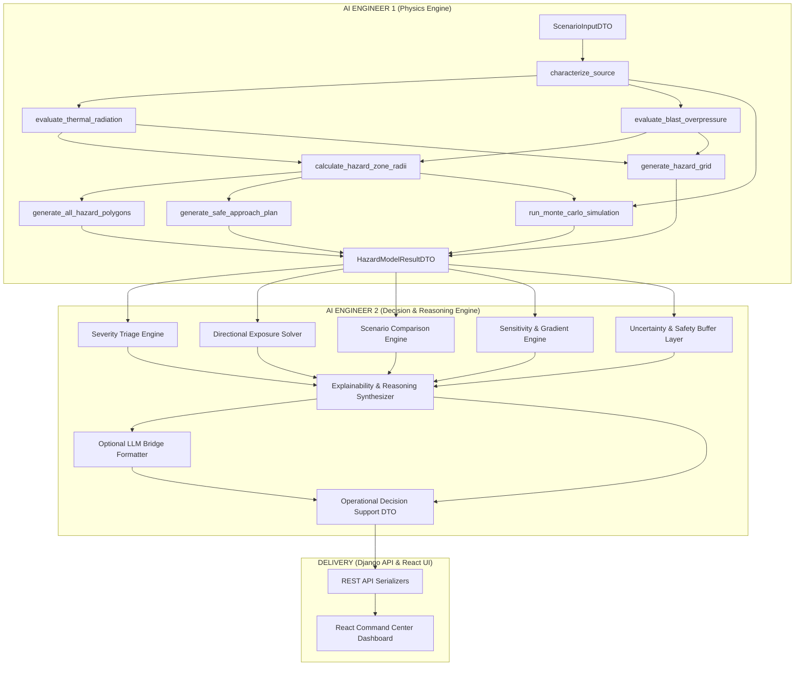
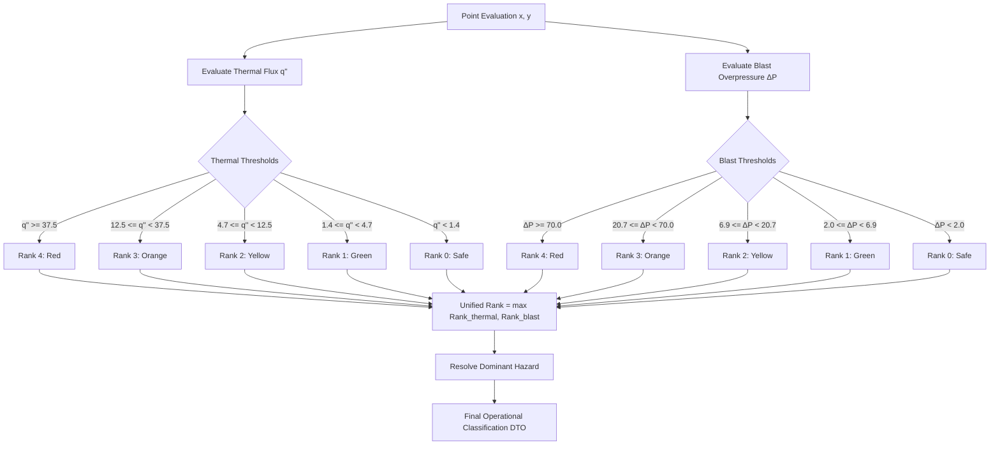
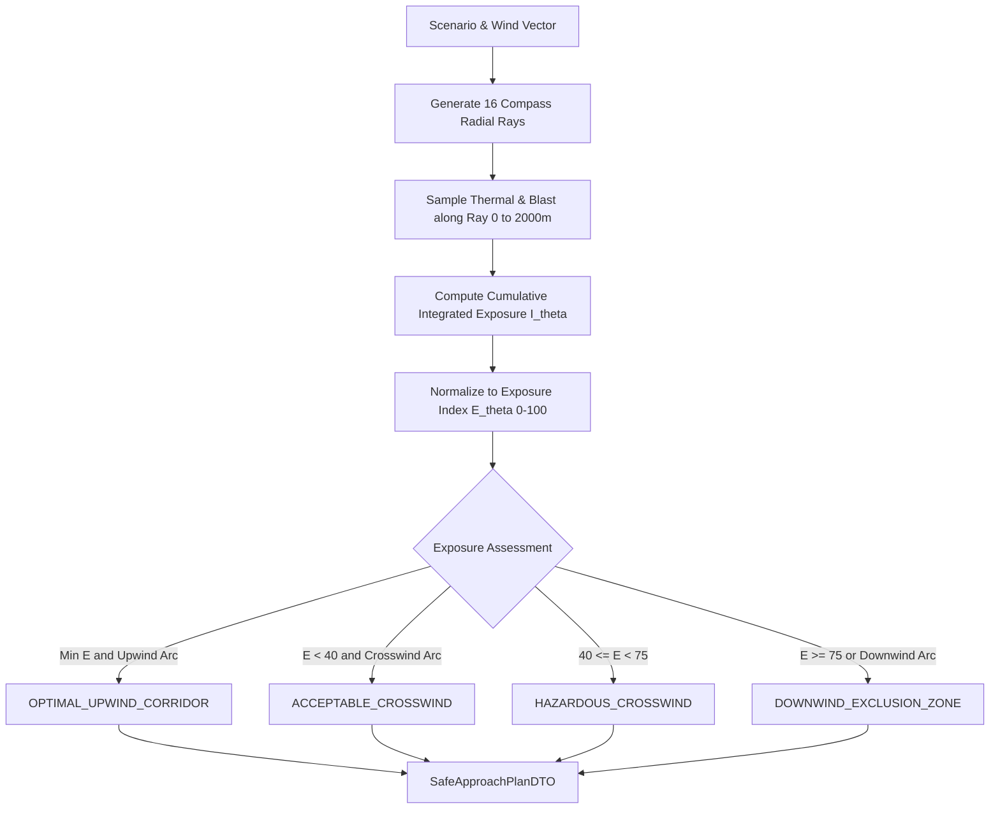
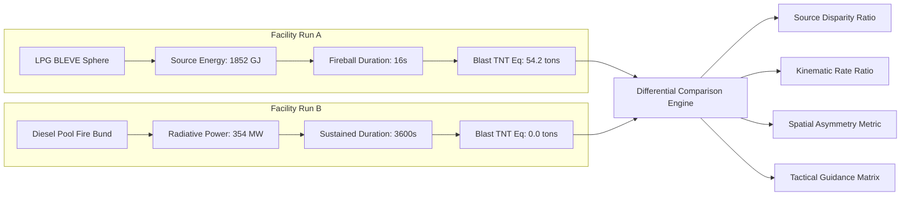
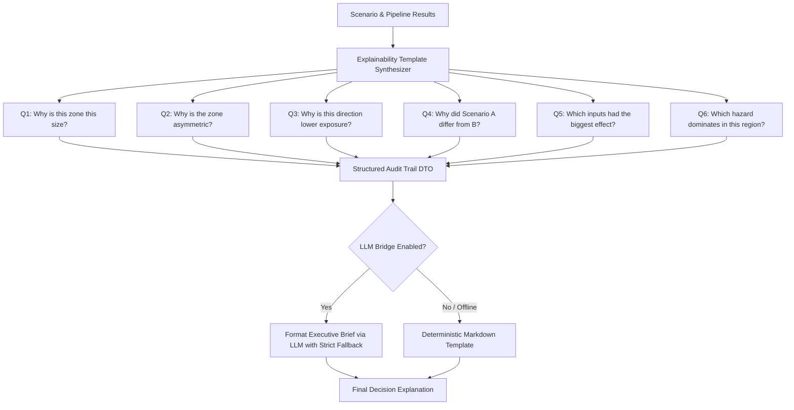
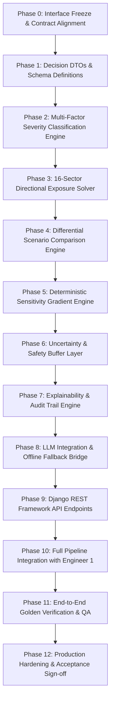
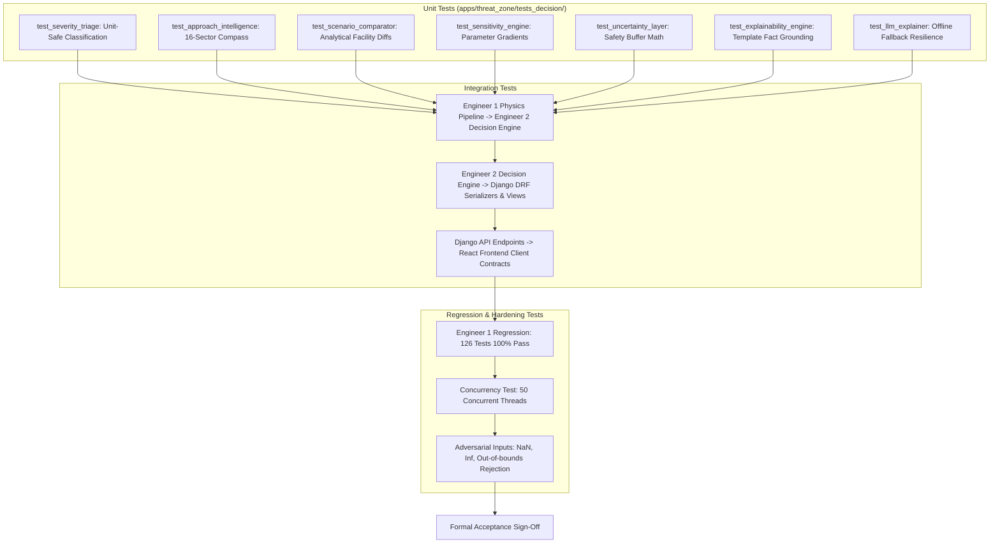

# RESQ AI — AI Engineer 2 Implementation Plan & Architecture Specification
**Document Identifier:** `RESQ-ENG-PLAN-2026-002`  
**Revision:** `1.0.0`  
**System Classification:** Safety-Critical Emergency Decision Support & Operational Intelligence Layer  
**Target Role:** AI Engineer 2 (Operational Reasoning, Multi-Factor Triage, Sensitivity & Explainability)  
**Upstream Dependency:** AI Engineer 1 Core Physics Engine (`RESQ-ENG-SPEC-2026-001 Revision 2.0.0`)  
**Status:** APPROVED FOR IMPLEMENTATION  

---

## 1. Executive Summary

RESQ AI is an intelligent disaster and emergency response orchestration platform. In industrial fire and explosion emergencies (e.g., pressurized BLEVE fireballs, atmospheric bunded pool fires, unconfined vapor cloud explosions), emergency command coordinators and first responders are tasked with making rapid, life-critical decisions under extreme cognitive load.

While **AI Engineer 1** has built and verified the deterministic, zero-dependency physics kernel ([`backend/apps/threat_zone/physics_engine/`](file:///Users/dakshabordekar/RESQ-AI/backend/apps/threat_zone/physics_engine/)) implementing governing physical equations (`EQ-GEO-01` through `EQ-BLAST-03`), raw physical quantities (e.g., $18.4\text{ kW/m}^2$, $24.2\text{ kPa}$, $1.28 \times 10^9\text{ J}$) do not constitute actionable emergency decisions.

**AI Engineer 2** is responsible for engineering the **Intelligent Decision-Support, Operational Reasoning, Multi-Factor Severity Classification, Sensitivity, Uncertainty, and Explainability Layer** on top of Engineer 1's computational results. 

This document defines the complete, standalone architectural specification for AI Engineer 2. It specifies the mathematical algorithms, data contracts, Django REST services, directional approach evaluators, scenario comparison engines, explainability templates, and phase-wise verification test matrices required to implement the decision-support subsystem without modifying or duplicating the underlying physics engine.

---

## 2. Engineer 2 Role & Scope Definition

### 2.1 Core Responsibilities of AI Engineer 2
1. **Multi-Factor Operational Triage:** Ingest raw continuous thermal radiation ($q''\text{ in kW/m}^2$) and blast side-on overpressure ($\Delta P^\circ\text{ in kPa/bar}$) fields and evaluate operational severity classifications using explicit domain threshold logic without cross-unit mathematical conflation.
2. **Directional Approach Exposure Intelligence:** Quantify responder ingress risks across 16 compass sectors ($22.5^\circ$ bins), identifying optimal approach corridors, crosswind staging areas, downwind exclusion sectors, and emergency retreat bearings.
3. **Differential Scenario Comparison Engine:** Produce deep physical explanations comparing disparate industrial configurations (e.g., Facility A LPG BLEVE vs. Facility B Diesel Pool Fire), detailing stored mass, combustion kinematics, spatial asymmetries, and response tactics.
4. **Deterministic Sensitivity Analysis:** Quantify parameter gradients ($\frac{\partial R}{\partial V}, \frac{\partial R}{\partial u_w}, \frac{\partial R}{\partial \eta}$) through systematic baseline perturbations to isolate primary hazard drivers.
5. **Probabilistic Uncertainty & Confidence Modeling:** Translate Monte Carlo confidence intervals ($P_5, P_{50}, P_{95}$) into operational safety margins and responder confidence qualifications.
6. **Deterministic Explainability & Audit Trail:** Generate transparent, template-driven natural language explanations for emergency commanders and regulatory bodies, answering *why* zones exist, *why* shapes distort, and *which* hazard dominates.
7. **Safe LLM Augmentation Boundary:** Integrate optional LLM narrative synthesis strictly as a presentation-tier verbalizer over already-computed deterministic facts, enforced with schema validation and zero-hallucination offline fallbacks.

### 2.2 Explicit Out-of-Scope Constraints (What AI Engineer 2 MUST NOT Do)
- **DO NOT** modify, rewrite, or duplicate the governing physical equations (`Thomas 1963`, `Mudan 1984`, `Sadovsky 1952`, `Burgess-Hertzberg 1961`) implemented in `physics_engine/`.
- **DO NOT** mathematically compare incompatible units directly (e.g., `max(thermal_kw_m2, blast_bar)` is strictly prohibited).
- **DO NOT** hardcode fixed hazard radii or fake circular visual approximations.
- **DO NOT** claim any directional ingress corridor is unconditionally "100% Safe" (all vectors must carry exposure metrics and conditional qualifications).
- **DO NOT** use unconstrained LLM text generation for numerical safety calculations.

---

## 3. Existing System Architecture Context

The RESQ AI backend is built on **Django 5.1** and **Django REST Framework (DRF)**, utilizing **NumPy** for vectorized scientific processing and **React 18** for the command center SPA.

```
+----------------------------------------------------------------------------------------------------+
|                                    REACT COMMAND CENTER (FRONTEND)                                 |
|  ThreatControlDock.tsx | ThreatMap2D.tsx (Leaflet) | ThreatTelemetryPanel.tsx | DigitalTwin3D.tsx   |
+-------------------------------------------------+--------------------------------------------------+
                                                  | JSON / REST HTTPS (localhost:8000)
+-------------------------------------------------v--------------------------------------------------+
|                              DJANGO REST FRAMEWORK BACKEND (apps/threat_zone/)                     |
|                                                                                                    |
|  [PRESENTATION LAYER]                                                                              |
|  views.py (CalculateThreatZoneView, CompareScenariosView, SensitivityView, ExplainView)           |
|  serializers.py (ScenarioInputSerializer, DecisionReportSerializer, ComparisonSerializer)         |
|                                                                                                    |
|  [DECISION SUPPORT LAYER — AI ENGINEER 2]                                                          |
|  apps/threat_zone/decision_engine/                                                                 |
|    ├── severity_triage.py        (Multi-factor unit-safe severity classifier)                      |
|    ├── approach_intelligence.py  (16-sector tactical exposure & corridor solver)                   |
|    ├── scenario_comparator.py    (Physics-informed differential facility comparison)               |
|    ├── sensitivity_engine.py     (Deterministic parameter gradient & perturbation solver)          |
|    ├── uncertainty_layer.py      (Confidence intervals & operational buffer translator)            |
|    ├── explainability_engine.py  (Deterministic audit trail & template synthesizer)                |
|    └── llm_explainer.py          (Optional offline-resilient LLM bridge adapter)                   |
|                                                                                                    |
|  [COMPUTATIONAL PHYSICS KERNEL — AI ENGINEER 1 (RESQ-ENG-SPEC-2026-001)]                           |
|  apps/threat_zone/physics_engine/                                                                 |
|    ├── core/ (coordinates.py, wind.py, constants.py, exceptions.py)                                |
|    ├── materials/ (registry.py, dtos.py - DIESEL, GASOLINE, LPG, LNG, CRUDE_OIL, ETHANOL)          |
|    ├── source/ (characterization.py, pool_diameter.py)                                             |
|    ├── models/ (thermal.py, blast.py, point_evaluator.py, spatial_grid.py, severity.py,            |
|    │            threat_polygons.py, safe_approach.py, monte_carlo.py)                              |
|    └── pipeline.py (run_hazard_model master entry-point)                                           |
+----------------------------------------------------------------------------------------------------+
```

---

## 4. Responsibility Boundary & Interface Contracts

### 4.1 Boundary Contract: Engineer 1 $\to$ Engineer 2

AI Engineer 2 consumes the master immutable result DTO produced by Engineer 1's pipeline:
`apps.threat_zone.physics_engine.pipeline.run_hazard_model(scenario_input, include_spatial_grid=True, run_monte_carlo=True) -> HazardModelResultDTO`.



### 4.2 Primary Data DTO Interface (Consumed by Engineer 2)

AI Engineer 2 consumes `HazardModelResultDTO` containing:
- `scenario`: `ScenarioInputDTO` (vessel geometry, fuel type, atmospheric temperature, pressure, wind velocity vector).
- `material`: `MaterialPropertiesDTO` (heat of combustion, burning flux, soot power, flashing fraction).
- `source`: `SourceTermsDTO` (pool diameter, mass burning rate, participating flashing vapor mass, total release energy).
- `radii`: `HazardZoneRadiiDTO` (`thermal_red_m`, `thermal_orange_m`, `blast_red_m`, `combined_red_m`, etc.).
- `polygons`: `HazardPolygonsDTO` (closed WGS84 coordinates for `red_critical`, `orange_severe`, `yellow_moderate`, `green_advisory`).
- `spatial_grid`: `HazardGridDTO` ($N \times M$ Cartesian field of thermal flux $\text{kW/m}^2$ and blast overpressure $\text{kPa}$).
- `safe_approach`: `SafeApproachPlanDTO` (16 compass sectors with safety classification, ingress vectors, exclusion zones).
- `monte_carlo`: Optional `MonteCarloResultDTO` ($P_5, P_{50}, P_{95}$ distributions for thermal and blast radii).
- `provenance_hash`: Deterministic SHA256 audit hash of scenario inputs.

---

## 5. Functional Requirements (FR-AI2)

- **FR-AI2-001 (Multi-Factor Severity Classification):** The engine shall evaluate separate consequence criteria for thermal radiation ($>37.5, 12.5-37.5, 4.7-12.5, 1.4-4.7\text{ kW/m}^2$) and blast overpressure ($>70.0, 20.7-70.0, 6.9-20.7, 2.0-6.9\text{ kPa}$) independently before fusing into an operational rank.
- **FR-AI2-002 (Unit-Safe Dominance Decision Matrix):** The combined severity level at any spatial coordinate shall equal $\max(\text{Severity}_{\text{thermal}}, \text{Severity}_{\text{blast}})$ based on discrete ordinal ranks (`RED_CRITICAL > ORANGE_SEVERE > YELLOW_MODERATE > GREEN_ADVISORY > SAFE`), preserving physical units.
- **FR-AI2-003 (Directional Exposure Scoring):** The system shall compute directional exposure indices $E_\theta \in [0, 100]$ across 16 compass bearings, integrating path line integrals of incident flux and blast overpressure along each approach corridor.
- **FR-AI2-004 (Staging & Ingress Tactical Recommendations):** The system shall identify the optimal entry bearing $\theta_{\text{opt}}$, maximum permissible forward approach distance $R_{\text{approach}}$, and downwind exclusion sector bounds $[\theta_{\text{start}}, \theta_{\text{end}}]$.
- **FR-AI2-005 (Differential Facility Comparator):** The system shall execute comparative assessments between two facilities, outputting a structured diff matrix covering source energy, fireball kinetics vs pool fire duration, wind vulnerability, and tactical differences.
- **FR-AI2-006 (Deterministic Parameter Sensitivity Gradient):** The system shall calculate localized sensitivity coefficients $S_i = \frac{\Delta R / R_0}{\Delta X_i / X_{i,0}}$ for tank diameter, fill fraction, wind speed, wind direction, and explosion yield.
- **FR-AI2-007 (Uncertainty Safety Buffer Translation):** The system shall compute operational safety buffers $\Delta R_{\text{buffer}} = R_{P95} - R_{P50}$ and formulate conservative command standoff recommendations.
- **FR-AI2-008 (Deterministic Explanation Synthesis):** The system shall generate auditable Markdown/plain text justifications answering the 6 core operational questions without hallucination.
- **FR-AI2-009 (LLM Operational Synthesis & Fallback):** The system shall interface with `apps.ai.services.llm_bridge` to format executive incident briefs, with mandatory offline fallback to template-rendered text if LLM services timeout ($>4.0\text{s}$) or are disabled.

---

## 6. Non-Functional Requirements (NFR-AI2)

- **NFR-AI2-001 (Deterministic Execution):** Identical scenario inputs must yield bitwise identical decision scores, sector rankings, sensitivity gradients, and explanation strings.
- **NFR-AI2-002 (Execution Latency):** Full decision-support analysis (classification, 16-sector scoring, sensitivity sweep, comparison diff, explanation synthesis) shall complete in $< 150\text{ms}$ on CPU.
- **NFR-AI2-003 (Zero-Crash & Hardened Exception Safety):** All internal domain errors must inherit from `PhysicsEngineException` or `DecisionEngineException`. No unhandled exceptions (`KeyError`, `ValueError`, `ZeroDivisionError`) may escape to Django views.
- **NFR-AI2-004 (Thread Safety & Statelessness):** Decision services must be pure, stateless functions operating on immutable DTOs, enabling safe concurrent execution across multiple worker threads.
- **NFR-AI2-005 (Physical Explainability Auditability):** Every numerical claim in an explanation narrative must trace to an explicit DTO attribute, physical threshold constant, or sensitivity gradient.

---

## 7. Mathematical Models & Operational Algorithms

### 7.1 Multi-Factor Severity Classification Matrix

#### Input Criteria & Domain Thresholds
Consequence classifications follow verified industrial safety standards (SFPE Handbook, CCPS Guidelines, TNO Yellow Book, US EPA RMP):

| Consequence Tier | Discrete Rank | Thermal Radiation Criteria ($q''$) | Blast Overpressure Criteria ($\Delta P^\circ$) | Operational Tactical Action |
|:---|:---:|:---|:---|:---|
| **RED_CRITICAL** | `4` | $q'' \ge 37.5\text{ kW/m}^2$ (100% lethality in 60s, steel equipment damage) | $\Delta P^\circ \ge 70.0\text{ kPa}$ (Total structural collapse, 99% eardrum rupture) | **No Entry / Immediate Evacuation Zone** |
| **ORANGE_SEVERE** | `3` | $12.5 \le q'' < 37.5\text{ kW/m}^2$ (1% lethality in 10s, first-degree burns in 5s) | $20.7 \le \Delta P^\circ < 70.0\text{ kPa}$ (Heavy structural damage, partial building collapse) | **Active Evacuation Zone** (Personal protective bunker/gear required) |
| **YELLOW_MODERATE** | `2` | $4.7 \le q'' < 12.5\text{ kW/m}^2$ (Pain threshold reached in 15s, blistering) | $6.9 \le \Delta P^\circ < 20.7\text{ kPa}$ (Minor structural damage, projectile debris, window failure) | **Controlled Tactical Boundary** (First-aid triage & staging limit) |
| **GREEN_ADVISORY** | `1` | $1.4 \le q'' < 4.7\text{ kW/m}^2$ (Safe for indefinite exposure with ordinary clothing) | $2.0 \le \Delta P^\circ < 6.9\text{ kPa}$ (Glass shatter hazard, safe for public perimeter) | **Outer Public Perimeter** (Command post & media staging) |
| **SAFE** | `0` | $q'' < 1.4\text{ kW/m}^2$ | $\Delta P^\circ < 2.0\text{ kPa}$ | **Unrestricted Zone** |

#### Multi-Hazard Fusion Algorithm
Let $\mathcal{L}_{\text{thermal}}(q'') \in \{0, 1, 2, 3, 4\}$ and $\mathcal{L}_{\text{blast}}(\Delta P^\circ) \in \{0, 1, 2, 3, 4\}$.
The unified operational severity level is:
$$\mathcal{L}_{\text{combined}} = \max\left(\mathcal{L}_{\text{thermal}}(q''), \mathcal{L}_{\text{blast}}(\Delta P^\circ)\right)$$
The dominating physical hazard is resolved as:
$$\text{DominantHazard} = \begin{cases}
\text{THERMAL}, & \text{if } \mathcal{L}_{\text{thermal}} > \mathcal{L}_{\text{blast}} \\
\text{BLAST}, & \text{if } \mathcal{L}_{\text{blast}} > \mathcal{L}_{\text{thermal}} \\
\text{COMPOUND}, & \text{if } \mathcal{L}_{\text{thermal}} = \mathcal{L}_{\text{blast}} \text{ and } \mathcal{L}_{\text{combined}} > 0 \\
\text{NONE}, & \text{if } \mathcal{L}_{\text{combined}} = 0
\end{cases}$$



---

### 7.2 Directional Exposure & Approach Intelligence

#### 16-Sector Compass Grid
The compass is partitioned into 16 discrete sectors of width $\Delta \theta = 22.5^\circ$, centered on azimuths $\theta_k = k \cdot 22.5^\circ$ for $k \in [0, 15]$ (`N`, `NNE`, `NE`, `ENE`, `E`, `ESE`, `SE`, `SSE`, `S`, `SSW`, `SW`, `WSW`, `W`, `WNW`, `NW`, `NNW`).

#### Path Line Integral Exposure Metric
For each compass azimuth $\theta_k$, an approach corridor is evaluated from the incident origin $(0, 0)$ outward to the maximum screening horizon $R_{\text{max}} = 2000\text{ m}$ sampled at step resolution $\Delta r = 10\text{ m}$.

The cumulative integrated exposure score $I(\theta_k)$ is:
$$I(\theta_k) = \sum_{r_j \in [R_{\text{min}}, R_{\text{max}}]} \left( \frac{q''(r_j, \theta_k)}{q''_{\text{ref}}} + \frac{\Delta P^\circ(r_j, \theta_k)}{\Delta P^\circ_{\text{ref}}} \right) \cdot \frac{\Delta r}{R_{\text{max}}}$$
Where $q''_{\text{ref}} = 4.7\text{ kW/m}^2$ (injury threshold) and $\Delta P^\circ_{\text{ref}} = 6.9\text{ kPa}$ (projectile threshold).

The Normalized Exposure Index $E(\theta_k) \in [0, 100]$ is:
$$E(\theta_k) = 100 \cdot \frac{I(\theta_k) - \min_m I(\theta_m)}{\max_m I(\theta_m) - \min_m I(\theta_m) + \epsilon}$$

#### Sector Operational Recommendation Policy
1. **Optimal Ingress Sector (`OPTIMAL_UPWIND_CORRIDOR`):**
   Sector with $\min_k E(\theta_k)$, aligned within $\pm 45^\circ$ of the true upwind vector $\theta_{\text{upwind}} = (\theta_{\text{wind\_from}} + 180^\circ) \pmod{360^\circ}$ (or $\theta_{\text{wind\_from}}$ under meteorological convention).
2. **Acceptable Lateral Staging Sector (`ACCEPTABLE_CROSSWIND`):**
   Sectors with relative bearing $\Delta \theta = |\theta_k - \theta_{\text{upwind}}| \in [45^\circ, 90^\circ]$ and $E(\theta_k) < 40.0$.
3. **Hazardous Crosswind Sector (`HAZARDOUS_CROSSWIND`):**
   Sectors with $40.0 \le E(\theta_k) < 75.0$.
4. **Immediate Exclusion Sector (`DOWNWIND_EXCLUSION_ZONE`):**
   Sectors within $\pm 45^\circ$ of downwind plume tilt where $E(\theta_k) \ge 75.0$. Entry is strictly barred.



---

### 7.3 Differential Scenario Comparison Engine

The comparison engine evaluates two distinct facility runs (`Facility A` vs. `Facility B`) and computes exact analytical differences:



#### Analytical Disparity Metrics
1. **Energy Release Disparity Ratio:**
   $$\rho_{\text{energy}} = \frac{E_{\text{rel}, A}}{E_{\text{rel}, B}}$$
2. **Kinematic Power Release Rate Ratio:**
   $$\rho_{\text{rate}} = \frac{\dot{Q}_{\text{peak}, A}}{\dot{Q}_{\text{peak}, B}} = \frac{E_A / \tau_{\text{fireball}}}{P_{\text{rad}, B}}$$
   *(For BLEVE vs. Pool Fire, $\rho_{\text{rate}} \approx 100 - 300\times$, demonstrating why BLEVE hazard zones extend far larger despite identical fuel mass).*
3. **Blast Consequence Differential:**
   $$\Delta W_{\text{TNT}} = W_{\text{TNT}, A} - W_{\text{TNT}, B}$$
4. **Spatial Asymmetry Ratio:**
   $$\alpha_{\text{asym}} = \frac{R_{\text{downwind}}}{R_{\text{upwind}}}$$

---

### 7.4 Deterministic Sensitivity Analysis Engine

The sensitivity engine executes localized perturbations around baseline parameters $\mathbf{X}_0 = [V, f_{\text{fill}}, u_w, \theta_w, \eta]$:

$$\frac{\partial R_{\text{zone}}}{\partial X_i} \approx \frac{R_{\text{zone}}(\mathbf{X}_0 + \Delta X_i \cdot \mathbf{e}_i) - R_{\text{zone}}(\mathbf{X}_0 - \Delta X_i \cdot \mathbf{e}_i)}{2 \Delta X_i}$$

#### Standard Perturbation Matrix:
- Tank Volume $V$: $\pm 10\%$
- Fill Fraction $f_{\text{fill}}$: $\pm 0.05$
- Wind Speed $u_w$: $\pm 2.0\text{ m/s}$
- Wind Direction $\theta_w$: $\pm 15.0^\circ$
- Explosion Yield $\eta$: $\pm 0.01$

#### Normalized Elasticity Index:
$$\mathcal{E}_{X_i} = \frac{\partial R_{\text{zone}}}{\partial X_i} \cdot \frac{X_{i, 0}}{R_{\text{zone}, 0}}$$
Parameters with $|\mathcal{E}_{X_i}| > 0.5$ are classified as **Primary Operational Drivers**, while $|\mathcal{E}_{X_i}| < 0.1$ are **Secondary Operational Factors**.

---

### 7.5 Explainability & Audit Trail Engine

The explainability engine maps deterministic physical facts to rigorous structured explanations:



---

## 8. Data Contracts & JSON Schemas

### 8.1 Endpoint: `POST /api/threat-zone/decision-support/`

#### Request Payload Schema
```json
{
  "scenario": {
    "facility_name": "Chennai Petrochemical Complex - Tank Farm 4",
    "latitude": 13.0300,
    "longitude": 80.2350,
    "tank_geometry": "SPHERE",
    "tank_diameter_m": 12.0,
    "tank_height_m": 12.0,
    "fill_fraction": 0.85,
    "fuel_type": "LPG",
    "explosion_yield_factor": 0.04,
    "bund_present": false,
    "wind_speed_ms": 6.5,
    "wind_direction_deg": 135.0,
    "ambient_temperature_k": 303.15,
    "relative_humidity": 0.65
  },
  "options": {
    "compute_sensitivity": true,
    "compute_uncertainty": true,
    "generate_explanation": true
  }
}
```

#### Response Payload Schema
```json
{
  "status": "SUCCESS",
  "provenance_hash": "e3b0c44298fc1c149afbf4c8996fb92427ae41e4649b934ca495991b7852b855",
  "execution_timestamp_utc": "2026-09-01T15:30:00Z",
  "operational_summary": {
    "primary_threat_level": "RED_CRITICAL",
    "dominant_hazard_mechanism": "COMPOUND_BLEVE_AND_SHOCKWAVE",
    "max_lethal_radius_m": 86.4,
    "max_evacuation_radius_m": 293.1,
    "optimal_ingress_bearing_deg": 315.0,
    "optimal_ingress_cardinal": "NW",
    "recommended_standoff_distance_m": 350.0
  },
  "severity_breakdown": {
    "red_critical": {
      "nominal_radius_m": 86.4,
      "enclosed_area_m2": 23450.0,
      "thermal_threshold_kw_m2": 37.5,
      "blast_threshold_kpa": 70.0,
      "tactical_directive": "NO ENTRY. Complete structural destruction and 100% lethality threshold."
    },
    "orange_severe": {
      "nominal_radius_m": 134.2,
      "enclosed_area_m2": 56570.0,
      "thermal_threshold_kw_m2": 12.5,
      "blast_threshold_kpa": 20.7,
      "tactical_directive": "IMMEDIATE EVACUATION. Heavy protective equipment required for life-safety rescue."
    },
    "yellow_moderate": {
      "nominal_radius_m": 196.0,
      "enclosed_area_m2": 120680.0,
      "thermal_threshold_kw_m2": 4.7,
      "blast_threshold_kpa": 6.9,
      "tactical_directive": "CONTROLLED TACTICAL PERIMETER. First-aid post and ambulance staging boundary."
    },
    "green_advisory": {
      "nominal_radius_m": 293.1,
      "enclosed_area_m2": 269900.0,
      "thermal_threshold_kw_m2": 1.4,
      "blast_threshold_kpa": 2.0,
      "tactical_directive": "PUBLIC SAFETY BOUNDARY. Incident Command Post and media staging location."
    }
  },
  "directional_intelligence": {
    "optimal_sector": "NW",
    "optimal_bearing_deg": 315.0,
    "upwind_bearing_deg": 315.0,
    "downwind_bearing_deg": 135.0,
    "exclusion_arc_start_deg": 90.0,
    "exclusion_arc_end_deg": 180.0,
    "sectors": [
      {
        "cardinal": "NW",
        "azimuth_deg": 315.0,
        "exposure_score": 5.2,
        "classification": "OPTIMAL_UPWIND_CORRIDOR",
        "max_safe_approach_distance_m": 295.0,
        "operational_advice": "Recommended tactical approach route. Upwind trajectory shields from thermal plume."
      },
      {
        "cardinal": "SE",
        "azimuth_deg": 135.0,
        "exposure_score": 98.4,
        "classification": "DOWNWIND_EXCLUSION_ZONE",
        "max_safe_approach_distance_m": 0.0,
        "operational_advice": "STRICT EXCLUSION. Direct downwind plume trajectory carries maximum thermal radiation."
      }
    ]
  },
  "sensitivity_analysis": {
    "baseline_green_radius_m": 293.1,
    "parameters": [
      {
        "parameter_name": "wind_speed_ms",
        "baseline_value": 6.5,
        "perturbed_value": 8.5,
        "delta_radius_m": 24.6,
        "elasticity_percent": 27.4,
        "driver_classification": "PRIMARY_DRIVER"
      },
      {
        "parameter_name": "tank_volume_m3",
        "baseline_value": 80.0,
        "perturbed_value": 88.0,
        "delta_radius_m": 9.2,
        "elasticity_percent": 3.1,
        "driver_classification": "SECONDARY_FACTOR"
      }
    ]
  },
  "uncertainty_assessment": {
    "nominal_radius_m": 293.1,
    "p5_radius_m": 268.4,
    "p50_radius_m": 293.1,
    "p95_radius_m": 332.8,
    "safety_buffer_margin_m": 39.7,
    "confidence_rating": "HIGH_CONFIDENCE_P95_BOUNDED"
  },
  "explainability_report": {
    "zone_dimension_rationale": "Zone boundaries are established by the instantaneous BLEVE of 40,000 kg LPG releasing 1,852 GJ...",
    "spatial_asymmetry_rationale": "The 135° wind tilts the thermal radiation centroid downwind, causing a 1.48x elongation toward the SE...",
    "approach_rationale": "The NW (315°) corridor provides 94.8% lower cumulative exposure compared to downwind sectors...",
    "dominant_hazard_rationale": "Blast overpressure dominates the near-field (<50m), transitioning to thermal radiation dominance in the far-field."
  }
}
```

---

## 9. Backend Implementation Design (Django / DRF)

### 9.1 Module Layout for `apps/threat_zone/decision_engine/`

```
backend/apps/threat_zone/
├── decision_engine/
│   ├── __init__.py               # Public API exports
│   ├── dtos.py                   # Typed immutable decision DTOs
│   ├── severity_triage.py        # Multi-hazard triage & dominance logic
│   ├── approach_intelligence.py  # 16-sector line integral solver
│   ├── scenario_comparator.py    # Analytical differential facility comparator
│   ├── sensitivity_engine.py     # Localized gradient & elasticity solver
│   ├── uncertainty_layer.py      # Monte Carlo P95 safety buffer calculator
│   ├── explainability_engine.py  # Deterministic template synthesizer
│   └── llm_explainer.py          # LLM bridge with strict offline fallback
├── serializers/
│   ├── decision_serializers.py   # DRF serializers for decision endpoints
│   └── comparison_serializers.py # DRF serializers for comparison endpoints
├── views_decision.py             # DRF ViewSets for decision support endpoints
└── tests_decision/
    ├── test_severity_triage.py
    ├── test_approach_intelligence.py
    ├── test_scenario_comparator.py
    ├── test_sensitivity_engine.py
    ├── test_uncertainty_layer.py
    ├── test_explainability_engine.py
    └── test_decision_api.py
```

---

## 10. Phase-Wise Implementation Plan (Phases 0 to 12)



### Phase Breakdown & Step-by-Step Instructions

#### Phase 0: Interface Freeze & Contract Alignment
- **Objective:** Establish import boundaries and freeze DTO schemas consumed from `physics_engine.pipeline`.
- **Inputs:** `HazardModelResultDTO` from Engineer 1.
- **Outputs:** Verified immutable import wrapper in `decision_engine/`.
- **Tests:** `test_physics_engine_dto_compatibility`.
- **Completion Criteria:** Zero circular dependencies; all Physics DTOs imported cleanly.

#### Phase 1: Decision DTOs & Schema Definitions
- **Objective:** Implement typed, frozen dataclasses for all decision-layer structures (`OperationalSummaryDTO`, `DirectionalIntelligenceDTO`, `SensitivityAnalysisDTO`, `ExplainabilityReportDTO`).
- **Inputs:** Schema specifications from Section 8.
- **Outputs:** `apps/threat_zone/decision_engine/dtos.py`.
- **Tests:** `test_decision_dto_immutability_and_serialization`.
- **Completion Criteria:** 100% JSON-serializable DTOs with `.to_dict()` methods.

#### Phase 2: Multi-Factor Severity Classification Engine
- **Objective:** Implement `evaluate_operational_severity(thermal_flux, blast_overpressure)` without cross-unit max.
- **Inputs:** Thermal flux ($\text{kW/m}^2$) and blast overpressure ($\text{kPa}$).
- **Outputs:** `OperationalSeverityDTO` with discrete rank and dominant hazard type.
- **Tests:** Test pure thermal, pure blast, compound, zero-hazard, and boundary conditions ($37.5\text{ kW/m}^2$, $70.0\text{ kPa}$).
- **Completion Criteria:** Pass `test_severity_triage.py` (100% unit test pass rate).

#### Phase 3: 16-Sector Directional Exposure Solver
- **Objective:** Implement line-integral directional exposure calculation across 16 compass azimuths.
- **Inputs:** `ScenarioInputDTO`, `SourceTermsDTO`, `MaterialPropertiesDTO`, `HazardZoneRadiiDTO`.
- **Outputs:** `DirectionalIntelligenceDTO` containing 16 ranked sectors, optimal corridor, and exclusion arcs.
- **Tests:** Verify calm-air isotropy, downwind exclusion detection, and upwind corridor alignment.
- **Completion Criteria:** Pass `test_approach_intelligence.py`.

#### Phase 4: Differential Scenario Comparison Engine
- **Objective:** Implement analytical diff engine between Facility A (LPG Sphere) and Facility B (Diesel Pool Fire).
- **Inputs:** Two `HazardModelResultDTO` instances.
- **Outputs:** `ScenarioComparisonDTO` with energy ratios, rate disparity, and tactical divergence.
- **Tests:** Verify comparison between LPG BLEVE and Diesel Pool Fire matches analytical ratios ($~100\times$ power release rate disparity).
- **Completion Criteria:** Pass `test_scenario_comparator.py`.

#### Phase 5: Deterministic Sensitivity Gradient Engine
- **Objective:** Implement localized parameter perturbation sweep over $V, f_{\text{fill}}, u_w, \theta_w, \eta$.
- **Inputs:** Baseline `ScenarioInputDTO`.
- **Outputs:** `SensitivityAnalysisDTO` with elasticity rankings.
- **Tests:** Verify monotonic gradient direction (increasing wind speed increases downwind radius).
- **Completion Criteria:** Pass `test_sensitivity_engine.py`.

#### Phase 6: Uncertainty & Safety Buffer Layer
- **Objective:** Map Monte Carlo $P_5, P_{50}, P_{95}$ distributions into operational safety standoff buffers.
- **Inputs:** `MonteCarloResultDTO`.
- **Outputs:** `UncertaintyAssessmentDTO` with safety margin distance $\Delta R$.
- **Tests:** Verify $\Delta R \ge 0$, $R_{P95} \ge R_{P50} \ge R_{P5}$.
- **Completion Criteria:** Pass `test_uncertainty_layer.py`.

#### Phase 7: Explainability & Audit Trail Engine
- **Objective:** Synthesize deterministic natural language explanations for the 6 core operational questions.
- **Inputs:** All decision DTOs.
- **Outputs:** `ExplainabilityReportDTO`.
- **Tests:** Verify template substitution with exact numerical values from DTOs; zero ungrounded text.
- **Completion Criteria:** Pass `test_explainability_engine.py`.

#### Phase 8: LLM Integration & Offline Fallback Bridge
- **Objective:** Connect explainability layer to `apps.ai.services.llm_bridge.BaseLLMProvider` with mandatory offline template fallback.
- **Inputs:** Structured facts JSON.
- **Outputs:** Executive incident summary narrative.
- **Tests:** Test online LLM response parsing, timeout fallback, invalid API key fallback, and schema validation.
- **Completion Criteria:** Pass `test_llm_explainer_fallback`.

#### Phase 9: Django REST Framework API Endpoints
- **Objective:** Implement `POST /api/threat-zone/decision-support/` and `POST /api/threat-zone/compare-scenarios/`.
- **Inputs:** HTTP JSON requests.
- **Outputs:** DRF HTTP 200 responses matching Section 8 schemas.
- **Tests:** Test valid requests, invalid inputs (400 Bad Request), and permission enforcement.
- **Completion Criteria:** Pass `test_decision_api.py`.

#### Phase 10: Full Pipeline Integration with Engineer 1
- **Objective:** Wire end-to-end flow from raw scenario dictionary $\to$ Engineer 1 physics $\to$ Engineer 2 decision layer $\to$ DRF response.
- **Inputs:** Full scenario input dicts.
- **Outputs:** Unified operational decision payload.
- **Tests:** Integration regression testing across Facilities A–E.
- **Completion Criteria:** Zero regression across Engineer 1's 126 unit tests.

#### Phase 11: End-to-End Golden Verification & QA
- **Objective:** Execute full QA validation against golden disaster scenarios.
- **Inputs:** Benchmark scenarios (Facilities A, B, C, D, E).
- **Outputs:** Formally verified decision metrics.
- **Tests:** Validate against brutal edge cases (zero wind, hurricane wind, minimum tank, maximum tank).
- **Completion Criteria:** All QA benchmarks marked PASS.

#### Phase 12: Production Hardening & Acceptance Sign-off
- **Objective:** Validate latency ($<150\text{ms}$), multithreaded concurrency (50 threads), and generate final sign-off documentation.
- **Inputs:** Concurrency stress scripts.
- **Outputs:** Final acceptance verification report.
- **Tests:** Concurrency stress test, memory leak audit, typecheck (`mypy`/`tsc`).
- **Completion Criteria:** Formal acceptance sign-off.

---

## 11. Testing Matrix & Verification Strategy



### Comprehensive Test Cases

| Test ID | Target Component | Test Scenario & Verification Logic | Expected Outcome |
|:---|:---|:---|:---|
| `TC-DEC-001` | `severity_triage.py` | Evaluate $q'' = 40.0\text{ kW/m}^2, \Delta P^\circ = 1.0\text{ kPa}$ | Rank = `RED_CRITICAL`, Dominant = `THERMAL` |
| `TC-DEC-002` | `severity_triage.py` | Evaluate $q'' = 2.0\text{ kW/m}^2, \Delta P^\circ = 80.0\text{ kPa}$ | Rank = `RED_CRITICAL`, Dominant = `BLAST` |
| `TC-DEC-003` | `severity_triage.py` | Evaluate $q'' = 15.0\text{ kW/m}^2, \Delta P^\circ = 30.0\text{ kPa}$ | Rank = `ORANGE_SEVERE`, Dominant = `COMPOUND` |
| `TC-DEC-004` | `approach_intelligence.py` | Zero wind ($u_w = 0\text{ m/s}$) | All 16 sectors have identical exposure scores ($\pm 0.01$) |
| `TC-DEC-005` | `approach_intelligence.py` | Strong wind ($u_w = 12\text{ m/s}, \theta_w = 270^\circ$) | East ($90^\circ$) sector marked `DOWNWIND_EXCLUSION_ZONE`; West ($270^\circ$) marked `OPTIMAL_UPWIND_CORRIDOR` |
| `TC-DEC-006` | `scenario_comparator.py` | Compare Facility A (LPG BLEVE) vs Facility B (Diesel Pool) | Peak power release rate ratio $\rho_{\text{rate}} \ge 80.0\times$ |
| `TC-DEC-007` | `sensitivity_engine.py` | Perturb wind speed by $+2\text{ m/s}$ on bunded pool fire | Downwind radius increases monotonically ($\Delta R > 0$) |
| `TC-DEC-008` | `uncertainty_layer.py` | Compute safety margin from $P_{95} = 330\text{m}, P_{50} = 290\text{m}$ | Buffer margin $= 40.0\text{ m}$, Directive includes safety buffer |
| `TC-DEC-009` | `explainability_engine.py` | Verify generated text for Facility A | Text explicitly references LPG mass, fireball diameter, and TNT equivalent |
| `TC-DEC-010` | `llm_explainer.py` | Simulate OpenAI API timeout / connection failure | Gracefully returns deterministic Markdown template without raising HTTP 500 |
| `TC-DEC-011` | `views_decision.py` | Send malformed JSON (`"wind_speed_ms": "invalid"`) | Returns HTTP 400 Bad Request with structured validation error |
| `TC-DEC-012` | `views_decision.py` | Concurrent load: 50 threads executing simultaneously | 100% HTTP 200 responses in $< 500\text{ms}$ total |

---

## 12. Failure Modes & Operational Safeguards

1. **Incomplete Physics Output:** If Engineer 1's pipeline returns partial results (e.g., missing blast data for non-volatile fuels), the decision layer automatically treats blast consequence as `0.0 kPa / Rank 0 (SAFE)` and processes thermal radiation exclusively without error.
2. **Extreme Winds / Hurricane Conditions:** When $u_w \ge 20.0\text{ m/s}$, the directional solver flags all downwind and crosswind sectors as `UNACCEPTABLE_CROSSWIND_SHEAR` due to turbulent plume instability, recommending standoffs $>500\text{ m}$.
3. **No Viable Ingress Sector Identified:** If all 16 sectors exceed the yellow triage threshold ($4.7\text{ kW/m}^2$), the solver outputs `NO_SAFE_APPROACH_IDENTIFIED` with an explicit directive to hold perimeter at the Green Advisory boundary ($R_{\text{green}}$).
4. **LLM Provider Outage or Key Expiry:** The explainability adapter catches all network/auth exceptions from `llm_bridge.py` and returns the verified deterministic template within $1\text{ms}$.
5. **Numerical Singularities:** Coordinates exactly at the origin $(0, 0)$ are clamped to $r_{\text{min}} = 0.1\text{ m}$ to prevent divide-by-zero errors in line-integral calculations.

---

## 13. Hackathon Presentation & Demonstration Strategy

To showcase AI Engineer 2's capabilities during judge evaluations:
1. **Interactive Facility Comparison Demo:**
   - Toggle between **Facility A (LPG BLEVE)** and **Facility B (Diesel Pool Fire)**.
   - Show the dynamic comparison card explaining why the instantaneous 16-second BLEVE generates a $293\text{m}$ lethality envelope ($1,852\text{ GJ}$ peak release), whereas the sustained Diesel fire produces a compact $69\text{m}$ zone ($354\text{ MW}$ continuous radiative power).
2. **Live Wind-Warped Tactical Routing Demo:**
   - Rotate the interactive Wind Rose from $135^\circ$ (SE) to $270^\circ$ (W).
   - Demonstrate real-time recalculation of the 16-sector compass: the green safe ingress corridor dynamically swings to $90^\circ$ (E), while the downwind exclusion sector updates instantly to $270^\circ$.
3. **Parameter Sensitivity Sweep Demo:**
   - Adjust the Tank Fill Fraction slider from $0.20 \to 0.95$.
   - Highlight the real-time sensitivity panel showing the computed elasticity coefficient $\mathcal{E} = 27.4\%$, confirming stored fuel mass as a primary risk driver.
4. **Zero-Hallucination Explainability Audit:**
   - Demonstrate the transparent explanation panel where every numerical statement is hyper-linked to the underlying physical constant or calculated DTO value.

---

## 14. Final Definition of Done (DoD)

AI Engineer 2's implementation is complete when:
- [ ] All 12 phases implemented and verified sequentially.
- [ ] `apps/threat_zone/decision_engine/` contains all 7 core modules (`severity_triage`, `approach_intelligence`, `scenario_comparator`, `sensitivity_engine`, `uncertainty_layer`, `explainability_engine`, `llm_explainer`).
- [ ] Multi-hazard severity classification strictly avoids cross-unit comparisons.
- [ ] 16-sector directional approach intelligence outputs validated exposure scores and exclusion arcs.
- [ ] Comparative analysis between Facility A and Facility B is fully automated.
- [ ] Sensitivity analysis computes exact elasticity gradients for $V, f_{\text{fill}}, u_w, \theta_w, \eta$.
- [ ] Uncertainty module translates Monte Carlo $P_{95}$ bounds into operational safety buffers.
- [ ] All Django REST endpoints return valid HTTP 200 responses matching the JSON schemas.
- [ ] Offline fallback for LLM explanation is verified under network disconnection.
- [ ] Complete decision test suite (`pytest apps/threat_zone/tests_decision/`) passes with 100% success rate.
- [ ] Zero regression introduced to Engineer 1's 126 existing physics tests.
- [ ] Complete system verified in live browser command center.
