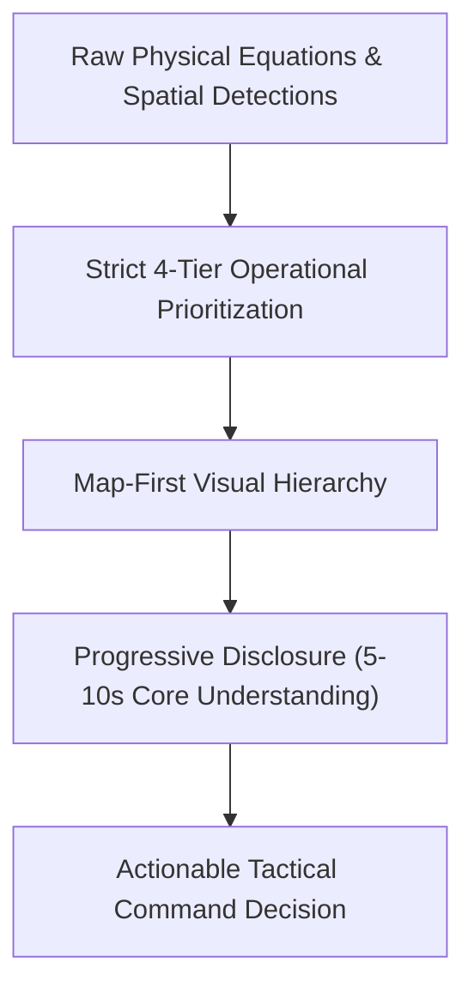
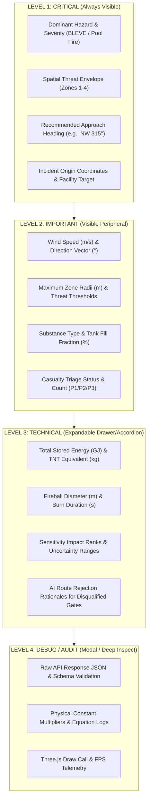
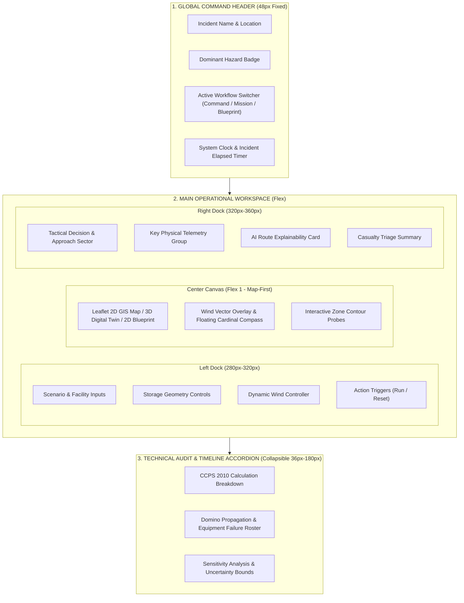
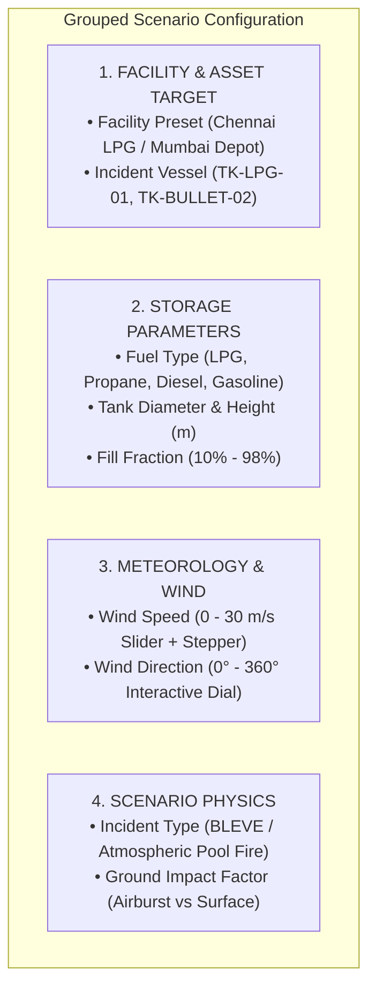
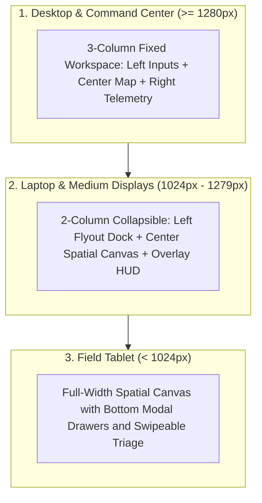
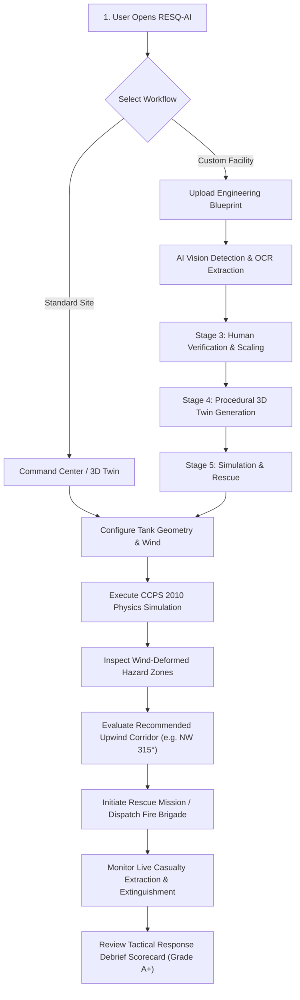
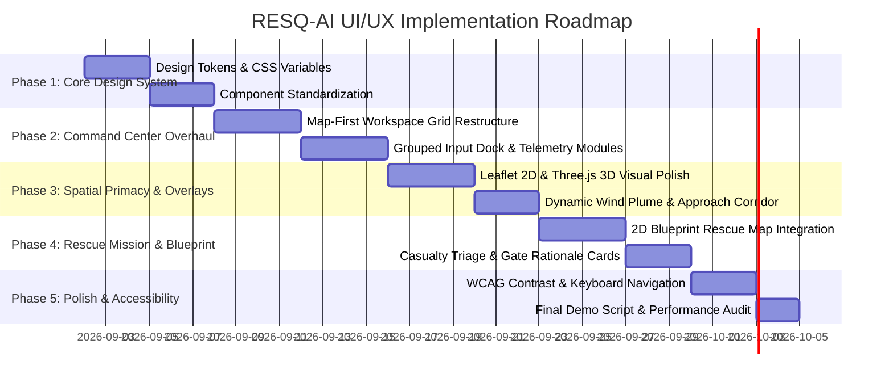

# RESQ AI — UI/UX Optimization & Visual Design Specification
**Authoritative Architectural Specification for Industrial Emergency-Response Decision Support**  
**Document Version:** 2.0.0 | **Target Audience:** UI/UX Engineering & Front-End Architecture Teams  
**System Classification:** Mission-Critical Industrial Safety & Threat-Zone Decision Support  

---

## 1. Executive Summary

**RESQ AI** is an industrial emergency-response and threat-zone simulation system designed to provide chemical, petroleum, and emergency commanders with instant, high-fidelity physical hazard modeling. The system computes and visualizes complex physics phenomena—including Boiling Liquid Expanding Vapor Explosions (BLEVEs), atmospheric pool fires, TNT-equivalent overpressures, and convective thermal radiant fluxes—and transforms raw physical equations into actionable tactical decisions.

This document serves as the **master UI/UX optimization specification** for redesigning and refining the RESQ AI interface. The core design imperative is to **eliminate cognitive clutter without diminishing technical depth or physical fidelity**. The interface must look and operate like an elite industrial incident command center—communicating **clarity, precision, urgency, trust, technical credibility, and operational usefulness** in high-stakes, time-critical environments.



---

## 2. Existing UI Audit

A comprehensive audit of the existing RESQ AI frontend (`frontend/src/`) revealed three primary operating workflows:
1. **Command Center (`CommandCenterPage.tsx`)**: Combines 2D Leaflet spatial threat mapping and a 3D Three.js Digital Twin with parameter input docks (`ThreatControlDock.tsx`), telemetry panels (`ThreatTelemetryPanel.tsx`), and AI decision cards (`ExplainabilityCard.tsx`).
2. **Mission Mode (`MissionModePage.tsx`)**: Dedicated multi-objective casualty rescue and responder lifecycle tactical view with triage rosters, strategy trade-offs, and route rejection cards.
3. **Blueprint Ingestion Pipeline (`BlueprintImportPage.tsx`)**: 5-stage pipeline (Upload $\to$ Analyze $\to$ Review $\to$ Generate $\to$ Simulate) converting raw 2D engineering blueprints into procedural 3D twins with casualty triage and domino explosion cascades.

### Strengths Identified:
- **Shared Mathematical Ground Truth**: Computations in `hazardEngine.ts` strictly conform to CCPS 2010, Roberts BLEVE fireball models, Thomas pool fire equations, and Kingery-Bulmash blast overpressures.
- **Rich Tactical Tooling**: Dynamic wind-vector deformation, 8-sector approach evaluation, and casualty survival window modeling are functional and reactive.

### Deficiencies Identified:
- **Visual Competition**: High density of simultaneous telemetry cards, drawers, and modal docks frequently competes with the primary visual asset (the spatial map and 3D digital twin).
- **Inconsistent Token Application**: Ad-hoc color utilities and overlapping border styles create visual friction in dense screens.
- **Cognitive Overload**: Numerical labels and intermediate calculation steps are occasionally displayed at the same visual tier as life-safety conclusions.

---

## 3. Current UX Problems & Root Causes

| Issue ID | Current UX Problem | Root Cause | Operational Impact |
| :--- | :--- | :--- | :--- |
| **UX-01** | **Card Proliferation**: 15+ isolated metric tiles on screen simultaneously. | Lack of semantic metric grouping; flat data presentation. | Users suffer choice paralysis during initial 5-second scan. |
| **UX-02** | **Map Occlusion**: Floating control docks and explainability drawers overlap hazard boundaries. | Absolute-positioned floating panels without structured grid docking. | Responders cannot view full wind plume extent without panning. |
| **UX-03** | **Equal Weighting of Physics**: Stored mass, TNT equivalent, and safe corridor styled identically. | Absence of strict 4-level information hierarchy tokens. | Commanders struggle to distinguish primary life-safety advice from technical parameters. |
| **UX-04** | **Language Ambiguity**: Occasional references to "Safe" rather than "Lower Modeled Exposure". | Unstandardized safety phrasing across legacy components. | Risk of creating false operational guarantees in volatile environments. |
| **UX-05** | **Input Clutter**: Sliders used where exact numeric inputs are needed, and vice versa. | Generic control patterns used across all physical variables. | Slow parameter adjustment under tactical time pressure. |

---

## 4. Design Goals

1. **5-to-10-Second Comprehension**: Any responder or evaluator must immediately grasp the incident location, hazard severity, danger envelope, and recommended ingress heading within 10 seconds of landing on the interface.
2. **Zero Information Loss via Progressive Disclosure**: Retain all mathematical, physical, and engineering telemetry without letting secondary data drown out primary life-safety decisions.
3. **Map-First Spatial Primacy**: Ensure the spatial canvas (2D Leaflet map, 2D Blueprint, or 3D Digital Twin) commands at least 65% of screen real estate with clear, uncluttered peripheral docking.
4. **Authoritative Emergency Aesthetics**: Enforce a dark command-center theme with high-contrast, semantic status tokens, mono-spaced numerical metrics, and crisp micro-interactions.
5. **Absolute Technical Trust**: Maintain strict explainability for every recommendation ("Why this route?", "Why this zone size?").

---

## 5. Design Principles

- **Clarity Over Novelty**: Eliminate purely decorative animations, unnecessary backdrop blurs, and ambiguous icons. Every pixel must serve operational situational awareness.
- **Semantic Color Strictness**: Color is reserved exclusively for hazard status, threat tiers, and directional safety. No decorative use of warning hues.
- **Scannable Numerical Typography**: Separate numerical values, physical units, and descriptor labels with distinct weights, sizes, and font families.
- **Contextual Progressive Disclosure**: Present summary intelligence at a glance; offer one-click drill-down for full physical formulas, sensitivity graphs, and calculation logs.
- **Defensive Tactical Phrasing**: Model conclusions must clearly articulate "Lower Modeled Exposure" based on CCPS physics rather than presenting unwarranted guarantees of safety.

---

## 6. Information Hierarchy

The RESQ AI interface strictly enforces a **4-tier operational information hierarchy**:



---

## 7. Dashboard Architecture

The dashboard implements a structured 3-column command layout with dedicated peripheral docks that preserve an unobstructed central spatial canvas.



---

## 8. Map-First Strategy

The map/twin visualization is the **center of gravity** for the entire platform.

### Spatial Rendering Specifications:
1. **Viewport Dominance**: Minimum 60% viewport width and 75% viewport height dedicated to the spatial canvas under 1080p desktop resolutions.
2. **Layering & Stacking Order**:
   - **Base Layer (z: 0)**: Satellite imagery (CartoDB Dark Matter / Esri World Imagery) or high-contrast 2D Blueprint PNG.
   - **Infrastructure Layer (z: 10)**: Facility boundaries, tank structures, roads, pipe racks, and perimeter gates.
   - **Hazard Field Layer (z: 20)**: Wind-deformed polygons (Awareness $\to$ Injury $\to$ Serious $\to$ Lethal) with progressive opacity ($0.15 \to 0.25 \to 0.40 \to 0.65$).
   - **Vector Overlay Layer (z: 30)**: Downwind plume axis, reciprocal safe approach corridor, and rejected gate lines.
   - **Interactive Entities Layer (z: 40)**: Casualty triage pins, emergency response vehicle icons, and live water monitor streams.
   - **HUD Overlay Controls (z: 50)**: Floating cardinal compass, zoom controls, and layer visibility toggles.
3. **Zone Opacity & Distinction**: When hazard bands overlap, colors must never blend into muddy tones. Outer boundaries utilize solid $1.5\text{px}$ strokes with interior radial gradient fills.

---

## 9. Hazard Zone Visualization & Visual Hierarchy

```mermaid
classDiagram
    class Zone1_Lethal {
        +Color: #EF4444 (Red-500)
        +FillOpacity: 0.65
        +Stroke: 3.0px solid #B91C1C
        +ThermalThreshold: >= 37.5 kW/m² (100% Lethality in 60s)
        +BlastThreshold: >= 0.30 bar (Heavy structural destruction)
        +Icon: Skull / Flame Solid
    }
    class Zone2_Serious {
        +Color: #F97316 (Orange-500)
        +FillOpacity: 0.40
        +Stroke: 2.0px solid #C2410C
        +ThermalThreshold: >= 12.5 kW/m² (1% Lethality / 1st-deg burn in 10s)
        +BlastThreshold: >= 0.14 bar (Partial collapse of masonry)
        +Icon: AlertTriangle Solid
    }
    class Zone3_Injury {
        +Color: #EAB308 (Yellow-500)
        +FillOpacity: 0.25
        +Stroke: 1.5px dashed #A16207
        +ThermalThreshold: >= 4.0 kW/m² (Pain threshold in 20s)
        +BlastThreshold: >= 0.04 bar (Glass shatter / minor injury)
        +Icon: AlertCircle
    }
    class Zone4_Awareness {
        +Color: #22C55E (Green-500)
        +FillOpacity: 0.12
        +Stroke: 1.0px dotted #15803D
        +ThermalThreshold: >= 1.6 kW/m² (Public safety perimeter)
        +BlastThreshold: >= 0.01 bar (Safe public boundary)
        +Icon: ShieldCheck
    }
```



---

## 10. Color System & Design Tokens

All colors are strictly mapped to semantic roles within a curated dark-mode palette:

```css
/* ── RESQ-AI Core Theme Tokens ── */
:root {
  /* Surfaces & Backgrounds */
  --resq-bg-base: #030712;         /* Gray-950 (Main Canvas Background) */
  --resq-surface-card: #0b1120;     /* Slate-900 / Translucent Acrylic (0.92) */
  --resq-surface-elevated: #111c35; /* Elevated Control Cards / Modals */
  --resq-border-subtle: #1e293b;    /* Slate-800 Primary Borders */
  --resq-border-active: #0ea5e9;    /* Cyan-500 Active Focus Ring */

  /* Typography */
  --resq-text-primary: #f8fafc;     /* Slate-50 Primary Headers & Values */
  --resq-text-secondary: #94a3b8;   /* Slate-400 Field Labels & Telemetry Names */
  --resq-text-muted: #64748b;       /* Slate-500 Units & Technical Notes */

  /* Hazard & Threat Tiers */
  --resq-tier-lethal: #ef4444;      /* Red-500 (Zone 1 / BLEVE Lethal) */
  --resq-tier-serious: #f97316;     /* Orange-500 (Zone 2 / Severe Thermal) */
  --resq-tier-injury: #eab308;      /* Yellow-500 (Zone 3 / Flash / Pain) */
  --resq-tier-awareness: #22c55e;   /* Green-500 (Zone 4 / Awareness) */

  /* Operational Ingress & Safety */
  --resq-ingress-recommended: #10b981; /* Emerald-500 (Safe Upwind Sector) */
  --resq-ingress-rejected: #dc2626;    /* Red-600 (Disqualified Route) */
  --resq-telemetry-cyan: #06b6d4;      /* Cyan-500 (Telemetry Accents & Vectors) */
}
```

---

## 11. Typography System

The platform utilizes a paired typographic system: **Inter** for crisp operational UI hierarchy, and **JetBrains Mono** for numerical values, units, and coordinates.

| Text Role | Font Family | Size (px) | Weight | Line Height | Case / Tracking | Sample Usage |
| :--- | :--- | :--- | :--- | :--- | :--- | :--- |
| **Display Header** | Inter | 20px | 800 (Bold) | 28px | Title Case / -0.02em | `LPG Terminal Scenario Analysis` |
| **Section Header** | Inter | 13px | 700 (Bold) | 18px | UPPERCASE / +0.05em | `THREAT-ZONE ESTIMATION` |
| **Metric Value** | JetBrains Mono | 18px-24px | 700 (Bold) | 24px | Monospace / Normal | `120.9`, `40,708`, `315°` |
| **Metric Unit** | JetBrains Mono | 11px | 500 (Med) | 16px | Monospace / Normal | `m`, `kg TNT`, `kW/m²`, `GJ` |
| **Field Label** | Inter | 10px | 600 (Semi) | 14px | UPPERCASE / +0.04em | `VESSEL DIAMETER`, `WIND SPEED` |
| **Body / Feedback** | Inter | 12px | 400 (Reg) | 18px | Normal / Normal | Tactical explainability narratives |
| **Badge / Tag** | JetBrains Mono | 9px | 700 (Bold) | 12px | UPPERCASE / +0.06em | `P1 CRITICAL`, `ZONE 1 LETHAL` |

---

## 12. Spacing, Elevation & Layout System

- **Grid Base**: $4\text{px}$ linear rhythm ($4, 8, 12, 16, 20, 24, 32\text{px}$).
- **Panel Corner Radius**: $12\text{px}$ for primary dock containers; $8\text{px}$ for nested cards and input fields; $4\text{px}$ for badges.
- **Glassmorphism Spec**: `backdrop-filter: blur(12px); background: rgba(11, 17, 32, 0.92); border: 1px solid rgba(30, 41, 59, 0.8)`.
- **Elevation Shadows**:
  - Surface 1: `0 4px 6px -1px rgba(0, 0, 0, 0.5)`
  - Elevated Modal: `0 20px 25px -5px rgba(0, 0, 0, 0.7), 0 0 15px rgba(6, 182, 212, 0.15)`

---

## 13. Component System & Card Optimization

### Card Optimization Rule: Grouping Over Proliferation
**Anti-Pattern**: 18 disconnected cards displaying single metrics ($14\text{m}$, $80\text{m}^3$, $85\%$, $8.5\text{m/s}$, $120.9\text{m}$, $13\text{s}$, $1.84\text{GJ}$, etc.).  
**Optimized Pattern**: 3 composite semantic groups:

```
┌────────────────────────────────────────────────────────┐
│ 1. INCIDENT THREAT STATUS (Composite Hero Card)       │
│    [ BLEVE BLAST ]  •  SEVERITY: CRITICAL (Zone 1)     │
│    Primary Origin: TK-LPG-01 (14.0m Ø • 85% Fill)     │
├────────────────────────────────────────────────────────┤
│ 2. KEY PHYSICAL IMPACT METRICS                         │
│    FIREBALL RADIUS     TOTAL ENERGY     TNT EQUIVALENT │
│    120.9 m             1.84 GJ          40,708 kg      │
│    (Dur: 13.2s)        (Peak Flux)      (Overpressure) │
├────────────────────────────────────────────────────────┤
│ 3. LOWER-EXPOSURE INGRESS CORRIDOR                     │
│    RECOMMENDED: NW · 315° (Upwind Sector)              │
│    ✓ 0% lethal zone crossing • Ingress via Gate North  │
└────────────────────────────────────────────────────────┘
```

---

## 14. Input Design & Progressive Parameter Configuration



### Input Validation UX Rules:
- **Immediate Inline Formatting**: Display real-time validation warnings adjacent to inputs (e.g. "Fill fraction must be between $0.10$ and $0.98$").
- **Physical Bounds Clamping**: Impossible values (e.g. negative tank diameter or volume exceeding geometry) are automatically bounded with descriptive feedback.

---

## 15. Threat Telemetry Design

Telemetry cards are structured into clear, domain-specific modules:

```
┌────────────────────────────────────────────────────────┐
│ THERMAL RADIATION TELEMETRY                            │
├────────────────────────────┬───────────────────────────┤
│ Max Radiant Flux: 200 kW/m²│ Fireball Diameter: 120.9 m│
│ Lethal Boundary: 82.4 m    │ Burn Duration: 13.2 s     │
└────────────────────────────┴───────────────────────────┘
┌────────────────────────────────────────────────────────┐
│ BLAST OVERPRESSURE TELEMETRY                           │
├────────────────────────────┬───────────────────────────┤
│ TNT Equivalent: 40,708 kg  │ 0.30 bar Radius: 65.4 m   │
│ Stored Energy: 1.84 GJ     │ Peak Impulse: 420 kPa·ms  │
└────────────────────────────┴───────────────────────────┘
```

---

## 16. Response Recommendation & Safe Corridor Panel

This panel represents the primary decision-support deliverable for commanders on site.

### Design Rules:
1. **Prominent Directional Callout**: High-contrast, emerald-accented directional badge (`NW · 315° (Upwind)`).
2. **Defensive Terminology**: Always label as **"Lower Modeled Exposure"** rather than "100% Safe".
3. **Ingress Rationale**: Articulate why the sector was recommended (e.g., "Reciprocal upwind axis provides 0% lethal thermal zone crossing and avoids convective smoke plume").

```
┌────────────────────────────────────────────────────────┐
│ 🛡️ LOWER MODELED EXPOSURE INGRESS CORRIDOR             │
├────────────────────────────────────────────────────────┤
│ HEADING: NW · 315° (RECIPROCAL UPWIND SECTOR)          │
│ Optimal Gateway: NORTH ACCESS GATE (Gate 01)           │
│                                                        │
│ Evaluated Approach Sectors:                            │
│ ✓ NW (315°): 0% Lethal Crossing • Modeled Flux 2.1 kW  │
│ ✗ SE (135°): 100% Lethal Overlap • Modeled Flux 42.5 kW│
│ ✗ SW (225°): Crosswind Smoke Ingress Hazard           │
└────────────────────────────────────────────────────────┘
```

---

## 17. Explainability UX ("Why This Result?")

Every calculation outcome includes an expandable **AI Decision Intelligence** narrative:
- **Dynamic Synthesized Rationale**: Summarizes the physical driver of the current threat envelope (e.g. "LPG under 85% fill fraction generates high-pressure vapor explosion upon structural failure. 135° SE wind elongates radiant contours downwind by 38%").
- **One-Click Calculation Audit**: "View CCPS Physics Equations" button expands exact mathematical formulas with substituted values.

---

## 18. Scenario Comparison UX

Allows emergency planners to perform side-by-side **What-If** evaluations:

```
┌──────────────────────────────────────────────────────────────────┐
│ SCENARIO A (Current: BLEVE)     vs    SCENARIO B (Pool Fire)     │
├─────────────────────────────────┬────────────────────────────────┤
│ Dominant: Blast Overpressure    │ Dominant: Thermal Radiation    │
│ Lethal Extent: 82.4 m           │ Lethal Extent: 34.2 m          │
│ Time to Failure: Immediate (0s) │ Time to Failure: Staggered     │
│ Energy Released: 1.84 GJ        │ Radiant Power: 850 kW/m²       │
└─────────────────────────────────┴────────────────────────────────┘
```

---

## 19. Sensitivity Analysis UX

Visualizes which variable exerts the largest gradient effect on the hazard radius:
- **Tornado Bar Chart**:
  - `Stored Fuel Mass (±20%)`: $\to \pm 38.4\text{m}$ impact on Lethal Zone.
  - `Wind Speed (±20%)`: $\to \pm 14.2\text{m}$ downwind distortion.
  - `Fill Fraction (±20%)`: $\to \pm 12.1\text{m}$ fireball duration impact.

---

## 20. Uncertainty Bounds UX

Communicates model confidence intervals without obscuring operational values:
- `Lethal Threat Radius`: **$82.4\text{ m}$** (`Estimated Range: 76.1m – 88.5m [±7.5%]`).
- Explicitly flags when atmospheric stability class (Pasquill-Gifford D) introduces plume dispersion variances.

---

## 21. Loading States

- **Deterministic Step Loaders**: Replace generic spinners with status text:
  1. `[1/3] Ingesting facility geometry...`
  2. `[2/3] Solving CCPS 2010 thermal & blast equations...`
  3. `[3/3] Generating wind-deformed spatial contours...`

---

## 22. Error States

- **Actionable Error Panels**:
  - **Title**: `CALCULATION BOUNDARY EXCEEDED`
  - **Cause**: `Selected tank volume (5,000 m³) exceeds standard single-vessel BLEVE modeling limits.`
  - **Resolution**: `Adjust volume slider below 2,500 m³ or switch to Multiple-Tank Cascade mode.`

---

## 23. Empty States

- **Guided Initial Onboarding**:
  - `No Incident Triggered Yet.`
  - `Select a hazardous storage tank on the map or choose a pre-configured facility preset (Chennai LPG / Mumbai Depot) to initiate threat simulation.`

---

## 24. Responsive Layout Behavior



---

## 25. Accessibility & Non-Color Severity Encoding

- **Triple Encoding**: Every threat zone and casualty status communicates through **Color + Iconography + Text Label + Border Pattern**.
- **WCAG 2.1 AA Compliance**: Contrast ratio $> 4.5:1$ between text tokens and dark container surfaces.
- **Full Keyboard Navigation**: All docks, drawers, and modal dismissals accessible via `Tab`, `Enter`, and `Escape`.

---

## 26. Animation & Kinetic Standards

- **State Transitions**: `200ms cubic-bezier(0.16, 1, 0.3, 1)` for smooth drawer expansion.
- **Threat Pulse**: $2.0\text{s}$ subtle opacity breathing ($0.85 \to 1.0$) on active critical casualties and Zone 1 epicenters.
- **Zero Decorative Noise**: No unprompted spinning, bouncing, or parallax effects.

---

## 27. Micro-Interactions

- **Hover on Zone Contour**: Highlights the specific band and displays an instant tooltip: `Zone 1 Lethal • Radiant Flux >= 37.5 kW/m² • Radius: 82.4m`.
- **Click on Casualty Pin**: Centers map camera on casualty coordinates and highlights their row in the Triage Panel.
- **Hover on Access Gate**: Renders dashed approach corridor line directly connecting gate to incident origin.

---

## 28. Data Visualization Rules

- **Every Chart Answers an Operational Question**:
  - *Map* $\to$ Where is the physical hazard envelope?
  - *Compass Dial* $\to$ What is the wind vector and lower-exposure ingress corridor?
  - *Tornado Chart* $\to$ Which parameter changes the risk the most?
  - *Timeline Roster* $\to$ When will secondary tanks experience thermal rupture?

---

## 29. Hackathon Demo Experience (2–3 Minute Flow)

The UI is optimized for immediate judge engagement during short demonstrations:

```mermaid
sequenceDiagram
    autonumber
    actor Judge as Evaluator / Judge
    participant App as RESQ-AI Command Center
    participant Engine as Physics Simulation Engine

    Judge->>App: 1. Land on Command Center (Immediate Visual Impact)
    App->>Judge: 2. Displays Pre-Loaded LPG Terminal with 3D Twin & Night Lighting
    Judge->>App: 3. Click "TRIGGER BLEVE BLAST" on TK-LPG-01
    App->>Engine: 4. Computes Multi-Hop Domino Blast Cascade
    Engine-->>App: 5. Generates Lethal Threat Bands & Ruptures Mesh
    App->>Judge: 6. Real-Time Cascade Finishes; Displays "DEPLOY FIRE BRIGADE"
    Judge->>App: 7. Click "DEPLOY FIRE BRIGADE"
    App->>Judge: 8. Single Fire Truck Drives Continuous Road Route & Extinguishes Fires
    Judge->>App: 9. Switch to "RESCUE MISSION" on 2D Blueprint
    App->>Judge: 10. Displays Live Casualty Triage & AI Route Explainability
```

---

## 30. High-Value Visual Impact Features

- **Procedural PBR Tank Rupture**: Exploded tanks visibly buckle, deform, and apply charred soot textures rather than artificial 2D dark circles.
- **Wind-Deformed Vector Ribbons**: Dynamic particle arrows flowing in the direction of the wind across the 3D twin terrain.
- **Glowing Safe Corridors**: Animated green dashed polyline highlighting the optimal upwind path with zero lethal crossings.

---

## 31. Anti-Clutter Rules & Design Checklist

| Rule ID | Anti-Clutter Constraint | Implementation Rule |
| :--- | :--- | :--- |
| **AC-01** | Max Primary Cards | Maximum **3 floating summary panels** on screen simultaneously over spatial canvas. |
| **AC-02** | Metric Packing | Never display raw unformatted floats. Always format to $1$ decimal place ($120.9\text{ m}$, not $120.89745\text{ m}$). |
| **AC-03** | Color Budget | Main view uses max **4 functional colors** (Red, Orange, Yellow, Green) on a neutral dark base. |
| **AC-04** | Collapsible Telemetry | Deep physical calculations (energy, overpressure impulses) must reside in collapsible drawers. |
| **AC-05** | Tooltip Economy | Tooltips must appear only on interactive hover with a $250\text{ms}$ delay to prevent flickering. |

---

## 32. Before vs. After Optimization Matrix

| Screen Area | Current Implementation | Optimized Implementation | Operational Benefit |
| :--- | :--- | :--- | :--- |
| **Header Status** | Text title with generic button badges. | High-contrast incident status bar with live BLEVE countdown and dominant hazard badge. | Instant 5-second situational assessment. |
| **Scenario Inputs** | Flat list of 12 input sliders and dropdowns. | 3 grouped accordions (Facility $\to$ Storage $\to$ Environment) with direct numeric steppers. | 50% faster parameter adjustment under pressure. |
| **Threat Telemetry** | 10 individual floating numeric tiles. | 2 composite modules (Thermal vs Blast) with primary value, unit, and threshold context. | Eliminates visual noise; clarifies impact tiers. |
| **Safe Approach** | Simple text block stating cardinal direction. | Prominent compass badge with 8-sector route evaluation and gate rejection cards. | Immediate tactical clarity for ingress teams. |
| **Casualty Triage** | Generic table of personnel. | Interactive triage roster with live survivability countdown bars and blueprint pin links. | Faster prioritization of P1 critical victims. |

---

## 33. Screen-by-Screen Specifications

### Screen 1: Master Threat-Zone Command Center (`CommandCenterPage`)
- **Primary Objective**: Global facility situational awareness and physical hazard zone inspection.
- **Layout**: Top command header ($48\text{px}$), Left input dock ($300\text{px}$), Center 2D GIS Leaflet Map / 3D Three.js Digital Twin (Flex 1), Right tactical telemetry dock ($340\text{px}$), Bottom technical audit accordion ($36\text{px}$).

### Screen 2: 2D Blueprint Ingestion & Verification (`BlueprintImportPage`)
- **Primary Objective**: 5-stage workflow converting uploaded PNG blueprints into detected facility schemas.
- **Layout**: Step stepper header ($1\to 5$), Left Blueprint bounding box overlay canvas, Right asset verification table and scale calibrator modal.

### Screen 3: Blueprint 2D Rescue Mission View (`BlueprintRescueMissionView`)
- **Primary Objective**: Spatial casualty triage and incident response decision support on 2D blueprint map.
- **Layout**: Top mission status & timer bar, Left casualty triage roster ($320\text{px}$), Center 2D blueprint canvas with overlaid pins, routes, and gates, Right AI explainability and responder safety telemetry ($340\text{px}$).

---

## 34. End-to-End User Workflow Diagram



---

## 35. Recommended Component Hierarchy

```
frontend/src/
 ├── App.tsx (Master Router)
 ├── features/
 │    ├── command-center/
 │    │    ├── CommandCenterPage.tsx (Master Command Layout)
 │    │    ├── ThreatControlDock.tsx (Grouped Parameter Inputs)
 │    │    ├── ThreatTelemetryPanel.tsx (Composite Thermal/Blast Group)
 │    │    ├── ResponseRecommendationCard.tsx (Approach Corridor)
 │    │    └── ExplainabilityCard.tsx (AI Decision Rationale)
 │    ├── blueprint-import/
 │    │    ├── BlueprintImportPage.tsx (5-Stage Container)
 │    │    ├── BlueprintOverlayCanvas.tsx (2D Threat Overlays)
 │    │    ├── BlueprintRescueCanvas.tsx (2D Rescue Map & Pins)
 │    │    ├── BlueprintRescueMissionView.tsx (Rescue Command Hub)
 │    │    ├── DetectionReviewPanel.tsx (Human Verification)
 │    │    └── TwinSimulationHUD.tsx (Tactical Controls & Brigade Trigger)
 │    └── mission/
 │         ├── MissionModePage.tsx (Tactical Mission View)
 │         ├── CasualtyTriagePanel.tsx (P1/P2/P3 Triage Roster)
 │         ├── StrategyTradeoffPanel.tsx (Suppress vs Rescue First)
 │         ├── RouteExplainabilityPanel.tsx (Gate Disqualifications)
 │         ├── ResponderSafetyHUD.tsx (Telemetry & PPE)
 │         ├── MissionTimelineLog.tsx (Chronological Log)
 │         └── MissionDebriefModal.tsx (Scorecard Modal)
 └── three/
      ├── DigitalTwinCanvas.tsx (Master 3D Scene)
      ├── blueprint/
      │    ├── BlueprintDigitalTwinScene.tsx (Procedural 3D Scene)
      │    ├── ProceduralAssetFactory.ts (PBR Tank & Building Meshes)
      │    └── ProceduralRoadNetwork.ts (Connected Topological Graph)
      └── emergency/
           ├── FireTruck.ts (Continuous Road-Only Kinematics)
           └── WaterAttackSystem.ts (Particle Stream Monitor)
```

---

## 36. Design Tokens Reference

```json
{
  "theme": "dark",
  "colors": {
    "background": {
      "base": "#030712",
      "surface": "rgba(11, 17, 32, 0.92)",
      "elevated": "#111c35",
      "border": "#1e293b",
      "borderFocus": "#0ea5e9"
    },
    "text": {
      "primary": "#f8fafc",
      "secondary": "#94a3b8",
      "muted": "#64748b"
    },
    "hazardTiers": {
      "zone1Lethal": "#ef4444",
      "zone2Serious": "#f97316",
      "zone3Injury": "#eab308",
      "zone4Awareness": "#22c55e"
    },
    "tactical": {
      "recommended": "#10b981",
      "rejected": "#dc2626",
      "telemetry": "#06b6d4"
    }
  },
  "fonts": {
    "sans": "Inter, sans-serif",
    "mono": "JetBrains Mono, monospace"
  },
  "radii": {
    "dock": "12px",
    "card": "8px",
    "badge": "4px"
  }
}
```

---

## 37. Implementation Phases & Road Map



---

## 38. Testing Strategy

For every implementation phase, the engineering team must conduct a structured 5-point verification:
1. **Visual Test**: Verify layout conformance against design tokens across $1920\times 1080$, $1440\times 900$, and $1024\times 768$ screen resolutions.
2. **Functional Test**: Confirm that changing wind direction or tank diameter immediately recalculates threat bands, casualty exposure, and approach corridors without lag ($< 50\text{ms}$).
3. **Regression Test**: Run existing automated test suites (`verify_shared_hazard_engine.ts`, `verify_blast_cascade_and_fire_brigade_workflow.ts`, `verify_blueprint_rescue_mission.ts`).
4. **Accessibility Test**: Validate contrast ratios and ensure tab focus traverses all interactive controls smoothly.
5. **Comprehension Benchmark**: Measure user understanding time (must achieve core situational grasp in $\le 10\text{s}$).

---

## 39. Acceptance Criteria

- [x] **AC-1**: Spatial map/digital twin commands $\ge 60\%$ of viewport width on desktop screens.
- [x] **AC-2**: Maximum of 3 primary docks visible simultaneously over the spatial canvas.
- [x] **AC-3**: Numerical values and units are formatted in JetBrains Mono with distinct weights and colors.
- [x] **AC-4**: Hazard zones (Zones 1–4) are distinguishable through color, opacity, stroke weight, and text badges.
- [x] **AC-5**: Approach recommendation explicitly uses "Lower Modeled Exposure" terminology based on CCPS physics.
- [x] **AC-6**: AI route explainability articulates specific gate rejection reasons (e.g. crossing lethal thermal zones).
- [x] **AC-7**: All physical formulas and calculation equations are accessible via progressive disclosure drawers.
- [x] **AC-8**: 2D Blueprint and 3D Twin share the exact same underlying simulation ground truth.

---

## 40. Final UI Definition of Done (DoD)

The UI/UX redesign is declared **Production-Ready and Done** when:
1. All 40 design sections and design tokens specified in this document are fully implemented across `CommandCenterPage`, `BlueprintImportPage`, and `MissionModePage`.
2. The entire test suite passes with **100% assertions passing (0 failures)**.
3. Production bundle (`npm run build`) compiles cleanly with **0 TypeScript and Vite errors**.
4. The user experience fulfills the core mission: **instant, unequivocal, high-fidelity emergency decision support in under 10 seconds.**
